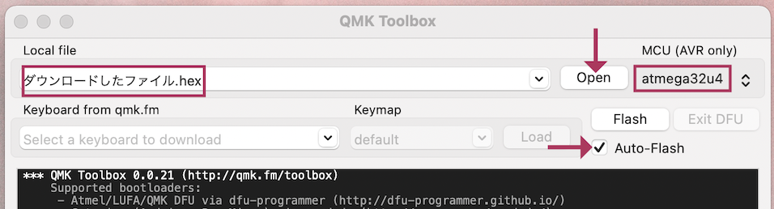
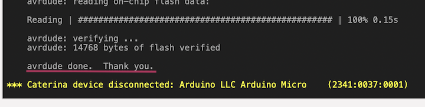
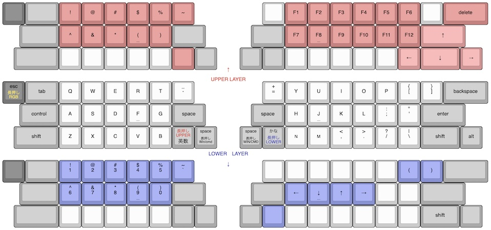
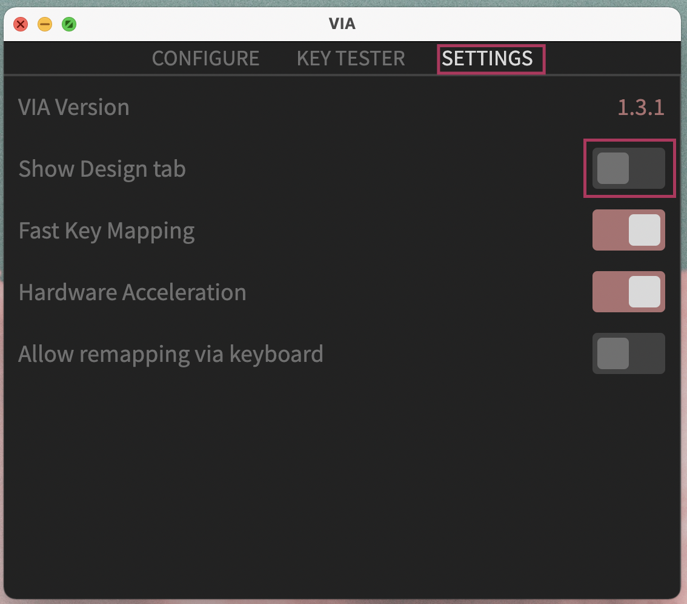

# Pop'n Top キーボード ビルドガイド
しおり  
- [組み立て方（はんだ付け）](#組み立て方はんだ付け)
- [動作テスト](#動作テスト)
- [組み立て方（後半）](#組み立て方後半)
- [カスタマイズ](#キーマップの確認変更方法)
- [おまけ](#おまけ)

## キット内容
  
||部品名|数| |
|-|-|-|-|
|1|メインボード|1|黒・大|
|2|ミドルプレート|1|透明・中|
|3|ボトムプレート|1|黒・中|
|4|ボトムプレート|1|透明・小|
|5|ネジ（短）|36|3mm、銀か黒が18個ずつ、もしくは36個|
|6|ネジ（長）|24|5mm、銀か黒が12個ずつ、もしくは24個|
|7|スペーサー（短）|18|3mm|
|8|スペーサー（長）|12|8mm|
|9|ダイオード|50||
|10|リセットスイッチ|2||
|11|TRRSジャック|2||
|12|ゴム足|4||

## キット以外に必要なもの
|部品名|数| |
|-|-|-|
|Pro Micro コンスルー付き|2|https://shop.yushakobo.jp/products/promicro-spring-pinheader|
|キースイッチ（Kailh Choc V2）|50|https://shop.yushakobo.jp/collections/all-switches/products/kailh-choc-v2|
|キーキャップ（CherryMX互換）|50|[選び方](misc.md#キーキャップの選び方)|
|TRRSケーブル|1|TRS（イヤホンのステレオミニ）ケーブルでもいいです。|
|Micro USB ケーブル|1|USB2.0 Micro-Bのもの。|

## 必要な工具
|工具名| |
|-|-|
|はんだごて||
|はんだごて置き場||
|鉛入りはんだ||
|細いドライバー|1番ドライバー|

## あると便利な工具
|工具名||
|-|-|
|斜めに切ったタイプのこて先||
|温度調節可能なはんだごて|300度-350度前後|
|ピンセット|LEDには必須|
|フラックス|LEDには必須|
|テスター||
|フラックスリムーバー||
|マスキングテープ||
|はんだ吸い取り線||
|リードベンダー||
|ラジオペンチ||
|ポスカ|基盤の側面を塗ってください。|

[▲トップに戻る](#Popn-Top-キーボード-ビルドガイド)
## 組み立て方（はんだ付け）
ダイオードの足を曲げて裏から差し込みます。  
ダイオードには向きがあります。三角形の先の棒と黒線を合わせましょう。  
  

表で更に足を曲げて抜けないようにします。  
ダイオードと並行に曲げるとあとでキースイッチに干渉しにくいです。
  

はんだ付けをして足を切ります。  
マスキングテープでダイオードを固定して足を先に切ると綺麗に仕上がります。  
表面実装型を使うと表からは穴しか見えなくなります。  
  

TRRSジャックを裏から差し込み表ではんだ付けします。  
終わったらリセットスイッチを裏から差し込み表ではんだ付けします。  
  

キースイッチを表から差し込み裏ではんだ付けします。  
  

メインボードの裏にコンスルーを挿します。  
コンスルーの窓が高く向きが同じになるように設置します。  
   
取り外せるように、挿すだけではんだ付けはしません。  

コンスルーにPro Microを挿します。TX0, RAW, USBの位置をシルク印刷と合わせましょう。  
そして、Pro Micro側のコンスルーの足を半田付けします。  
   
これでPro Microを抜き差しできるようになりました。  
両手分作り終えたら次に進んでください。  
[▲トップに戻る](#Popn-Top-キーボード-ビルドガイド)

## 動作テスト
電気的な部分が完成したのでPro Microに動作ソフト（ファームウェア）を書き込んで動作確認をしましょう。  
キットの左手用とPCをUSBケーブルでつないでください。   

Chrome, Edgeを使っているならPro Micro Web Updaterだとブラウザだけでできます。  
[▼Pro Micro Web Updaterを使う場合](#Pro-Micro-Web-Updaterを使う場合)  

使わない場合、QMK Toolboxをインストールしてテスト用のファームウェアをダウンロードして下さい。  
- QMK Toolbox https://github.com/qmk/qmk_toolbox/releases

- テスト用ファームウェア [popntop_test.hex](https://github.com/Taro-Hayashi/Pop-n-Top/releases/download/untagged-c08742267614e7d3a6a4/popntop_test.hex)

Openを押してダウンロードしたファイルを指定してAuto-Flashにチェックを入れます。  
MCUがatmega32u4になっていることも確認してください。  

　　
キットのリセットスイッチを押すとPro Microが赤く光り自動でファームウェアが書き込まれます。  
正常に書き込まれた場合"Thank you"のメッセージが出ます。  
  
（エラーが出る場合Auto-Flashのチェックを外し、リセットスイッチを押した直後にQMK ToolboxのFlashのボタンを押してみてください。）  

ファームウェアを更新する時もこの手順で行います。  

USBで接続しないと書き込めないので分割キーボードでは左手用と右手用に同じ手順を繰り返します。
反対側にも同じファームウェアを書き込んでください。  

書き込めたら一度USBケーブルを外し、TRRSケーブルで左右を繋げます。  
（TRRSケーブルを抜き差しするときはPCとは接続しない方が安全だそうです。）  
左手用とPCをUSBケーブルで接続してタイプすると1-50の数字が打てるはずです。  
反応しないキーが一箇所の場合スイッチ、同じ行で複数個の場合ダイオードのはんだが原因だと思います。   

お疲れ様でした。問題がなければはんだ付けは終了です。

[▲トップに戻る](#Popn-Top-キーボード-ビルドガイド)

## 組み立て方（後半）
USBケーブル、TRRSケーブルを抜いてプレートを組付けます。  
プレートには向きがあります。アクリルのミドルプレートは割れやすいので気をつけましょう。  

ボトムプレート（黒・中）にスペーサー（短）をネジ（短）で取り付けます。  
スペーサーが隠れるようにミドルプレートを嵌めます。  
  

組み合わせたものをメインボードの裏からPro Microに重ならないようにネジ（短）で止めます。   
  

ボトムプレート（透明・小）にスペーサー（長）をネジ（長）で取り付けます。  
Pro Microを覆うようにネジ（長）で止めます。  
   

キーキャップを取り付けたら本番用のファームウェアに更新しましょう。
- [popntop_default.hex]()

ゴム足を貼ってTRRSケーブルで左右を繋いだら完成です。

[▲トップに戻る](#Popn-Top-キーボード-ビルドガイド)
## キーマップの確認、変更方法
コンパクトな自作キーボードではレイヤー機能といって押している間は別のキーマップに切り替わるshiftやfnのようなキーを設けて、足りないボタンを補うことが多いです。  
このキットでもレイヤーを追加して使っています。デフォルトのキーマップはこのようになっています。  

[Keyboard Layout Editor で見る](http://www.keyboard-layout-editor.com/##@_backcolor=#ffffff&name=Layout%20-%20Pop'n%20Top%20KEYBOARD&author=T.Hayashi&switchMount=cherry&switchBrand=kailh&switchType=PG151101D05//D43&pcb:true;&@_c=#777777&a:7;&=&_c=#aaaaaa&w:1.5;&=&_c=#cf7e7e;&=!&=/@&=#&=$&=%25&_st=PG151101D05//D43;&=~&_x:3&c=#cccccc;&=&_c=#cf7e7e;&=F1&=F2&=F3&=F4&=F5&=F6&_c=#cccccc;&=&_c=#cf7e7e&w:2;&=delete;&@_x:0.75&c=#aaaaaa&w:1.75;&=&_c=#cf7e7e;&=%5E&=/&&=*&_n:true;&=(&=)&_c=#aaaaaa&w:1.5;&=&_x:2&w:1.5;&=&_c=#cf7e7e;&=F7&_n:true;&=F8&=F9&=F10&=F11&=F12&_c=#d99393&w:2;&=↑;&@_x:0.5&c=#aaaaaa&w:2;&=&_c=#cccccc;&=&=&=&=&=&_c=#cf7e7e;&=&_c=#aaaaaa;&=&_x:1;&=&=&_c=#cccccc;&=&=&=&=&=&_c=#d99393;&=←&_w:1.75;&=↓&_fa@:2;;&=→;&@_y:-0.25&x:8.75&c=#cccccc&t=#c91818&a:5&f:3&w:2.5&d:true;&=↑%0AUPPER%20LAYER;&@_y:-0.25&c=#777777&t=#000000%0A#dbbc1f&f2:2;&=esc%0A長押しRGB&_c=#aaaaaa&t=#000000&a:7&w:1.5;&=tab&_c=#cccccc;&=Q&=W&=E&=R&=T&_a:5&f:3;&=/_%0A%0A%0A%0A%0A%0A-&_x:3&f:3;&=+%0A%0A%0A%0A%0A%0A/=&_a:7;&=Y&=U&=I&=O&=P&_a:5&f:3;&=%7B%0A%0A%0A%0A%0A%0A%5B&_f:3;&=%7D%0A%0A%0A%0A%0A%0A%5D&_c=#aaaaaa&a:7&w:2;&=backspace;&@_x:0.75&w:1.75;&=control&_c=#cccccc;&=A&=S&=D&_n:true;&=F&=G&_c=#aaaaaa&w:1.5;&=space&_x:2&w:1.5;&=space&_c=#cccccc;&=H&_n:true;&=J&=K&=L&_a:5&f:3;&=/:%0A%0A%0A%0A%0A%0A/;&_f:3;&=%22%0A%0A%0A%0A%0A%0A'&_c=#aaaaaa&a:7&w:2;&=enter;&@_x:0.5&w:2;&=shift&_c=#cccccc;&=Z&=X&=C&=V&=B&_c=#aaaaaa&t=#c91818%0A#000000&a:5&fa@:2;;&=長押しUPPER%0A英数&_t=#000000&fa@:2&:1;;&=space%0A長押しWin//cmd&_x:1;&=space%0A長押しWIN//CMD&_t=#000000%0A#152bab&fa@:2&:2;;&=かな%0A長押しLOWER&_c=#cccccc&t=#000000&a:7;&=N&=M&_a:5&f:3;&=%3C%0A%0A%0A%0A%0A%0A,&_f:3;&=%3E%0A%0A%0A%0A%0A%0A.&_f:3;&=?%0A%0A%0A%0A%0A%0A//&_f:3;&=%7C%0A%0A%0A%0A%0A%0A%5C&_c=#aaaaaa&a:7&f:3&w:1.75;&=shift&_f:3;&=alt;&@_x:8.75&c=#cccccc&t=#152bab#1d2c8c%0A#152bab&a:5&f:3&w:2.5&d:true;&=LOWER%E3%80%80LAYER%0A↓;&@_y:-0.5&c=#777777&t=#000000&a:7;&=&_c=#aaaaaa&w:1.5;&=&_c=#8792d6&a:5&f:3;&=!%0A%0A%0A%0A%0A%0A1&_f:3;&=/@%0A%0A%0A%0A%0A%0A2&_f:3;&=#%0A%0A%0A%0A%0A%0A3&_f:3;&=$%0A%0A%0A%0A%0A%0A4&_f:3;&=%25%0A%0A%0A%0A%0A%0A5&_f:3;&=~%0A%0A%0A%0A%0A%0A%60&_x:3&c=#cccccc&a:7;&=&=&=&=&=&=&_c=#8792d6&f:3;&=(&_f:3;&=)&_c=#aaaaaa&w:2;&=;&@_x:0.75&w:1.75;&=&_c=#8792d6&a:5&f:3;&=%5E%0A%0A%0A%0A%0A%0A6&_f:3;&=/&%0A%0A%0A%0A%0A%0A7&_f:3;&=*%0A%0A%0A%0A%0A%0A8&_f:3&n:true;&=(%0A%0A%0A%0A%0A%0A9&_f:3;&=)%0A%0A%0A%0A%0A%0A0&_c=#aaaaaa&a:7&w:1.5;&=&_x:2&w:1.5;&=&_c=#8792d6&f:3;&=←&_f:3&n:true;&=↓&_f:3;&=↑&_f:3;&=→&_c=#cccccc;&=&=&_c=#aaaaaa&w:2;&=;&@_x:0.5&w:2;&=&_c=#cccccc;&=&=&=&=&=&_c=#aaaaaa;&=&=&_x:1;&=&_c=#8792d6;&=&_c=#cccccc;&=&=&=&=&=&=&_c=#aaaaaa&f:3&w:1.75;&=shift&=;&@_y:0.75&c=#e0cb58;&=&_c=#aaaaaa&w:1.5;&=&_c=#cccccc;&=&=&=&=&=&=&_x:0.25&t=#a18806&a:5&f:3&w:2.5&d:true;&=RGB%20LAYER&_x:0.25&t=#000000&a:7;&=&=&_c=#e0cb58&f:3;&=色相+&_f:3;&=彩度+&_f:3;&=明度+&_fa@:1;;&=スピード+&_c=#cccccc;&=&=&_c=#e0cb58&f:3&w:2;&=発光のオンオフ;&@_x:0.75&c=#aaaaaa&w:1.75;&=&_c=#cccccc;&=&=&=&_n:true;&=&=&_c=#aaaaaa&w:1.5;&=&_x:2&c=#e0cb58&fa@:2;&w:1.5;&=前のパターン&_c=#cccccc;&=&_n:true;&=&=&=&=&=&_c=#e0cb58&w:2;&=次のパターン;&@_x:0.5&c=#aaaaaa&w:2;&=&_c=#cccccc;&=&=&=&=&=&_c=#aaaaaa;&=&=&_x:1;&=&_c=#cccccc;&=&=&_c=#e0cb58&f:3;&=色相-&_f:3;&=彩度-&_f:3;&=明度-&_fa@:1;;&=スピード%20-&_c=#cccccc;&=&_c=#aaaaaa&w:1.75;&=&=)  

WindowsとMacの両方である程度キーを網羅するために必要以上にややこしくなっています。  
使わないキーやキーパッドに任せるキーは削除したり使用頻度の高いキーに入れ替えてしまいましょう。  

Chrome, EdgeがインストールされていればRemapを使うとブラウザだけで変更できます。  
[▼Remapを使う場合](#キーマップの変更にRemapを使う場合)  

そうでない場合はVIAをインストールして、下記JSONファイルをダウンロードしてください。
- VIA [https://github.com/the-via/releases/releases](https://github.com/the-via/releases/releases)
- [popntop.json](https://github.com/Taro-Hayashi/Pop-n-Top/releases/download/untagged-77514246efba8c20ff93/popntop.json)

起動したらSETTINGタブに移りShow Design tabをオンにします。  
  

DESIGNタブが出てくるのでクリックして、LOADボタンを押してダウンロードしたJSONファイルを指定しましょう。  
CONFIGUREタブに行くとキーマップを設定できるようになっています。  

  
キーボードのシルエットの変更したいキーをクリックしてから打ちたい文字をクリックするとキーマップがかわり、既にキーボードには反映されています。  

## キースイッチの選び方
Kailh choc v2という高さが低いキースイッチに対応しています。　　
軸の色で性能が違います。カチカチ音がする青、音がしない赤、中間の茶色があります。　　
　　
choc v1も使えると思いますが試していません。　　
v2とv1で使えるキーキャップが違うのでお気をつけください。　　
　　
## キーキャップの選び方
CherryMX互換のキーキャップを購入してください。　　
色々な種類があり形状によってプロファイルという大まかな分類があります。　　
このキーボードは配列が変則的なため、DSA、XDA/NP/PG、MAなど全てのキーが同じ高さのプロファイルだと手軽です。　

SAのように深いキーキャップだと表に出たコンスルーやダイオードのリードの足が当たるかもしれません。
  
手持ちで一番深かったRAZERのキーキャップはギリギリでした。
使おうと思っている方はPro Microは足を切ってはんだ付けしてしまったり表面実装のダイオードを使用すると安心でしょう。

長さにも種類があります。  
1U x 42個  
1.5U x 3個  
1.75U x 2個  
2U x 3個  
がこのキットで使う長さです。  
Uというのは正方形を1とした時の横幅です。  

打つ文字は自由に変更できますし、長いキーには短いキーキャップをはめることもできます。  
特に親指や人差し指で押すキーは使い方やキーキャップに合わせて変えるといいと思います。  
気に入った見た目のキーキャップセットと、足りない長さをバラで買うのがおすすめです。  
https://talpkeyboard.net/?category_id=59e2acfaed05e644fd004008  
https://shop.yushakobo.jp/collections/keycaps-1/products/dsa-blank-keycaps  

高めですがデザインが良く他のキットにも使いやすいキーキャップがたくさん入っているキーキャップセットです。  
NP PBT Crayon KEYCAPS SET https://shop.yushakobo.jp/collections/keycaps-1/products/np-pbt-crayon-keycaps-set  

文字なしですが安くて一通り入っています。  
NP PBT ブランクキーキャップセット https://talpkeyboard.net/items/6027a2686e84d5793d776135  
NP PBT BlankCrayon KEYCAPS SET https://shop.yushakobo.jp/collections/keycaps-1/products/np-pbt-blank-keycaps-set-124-keys  

[▲トップに戻る](#Popn-Top-キーボード-ビルドガイド)

## ケーブルについて
左右のキーボードを接続するケーブルはステレオイヤホンのケーブルと同じ種類です。TRSもしくはTRRSケーブルという名前でも販売されています。  
L字のコネクタのものを購入するか自作すると見た目が良くなります。  
micro-USBケーブルは充電専用ケーブルでないか気を付けてください。  

## LEDの取り付け方
必要なパーツ（余分に買っておくと安心です）  
|部品名|数| |
|-|-|-|
 |SK6812MINI-E|50|https://shop.yushakobo.jp/products/sk6812mini-e-10|
 |WS2812B|9|https://shop.yushakobo.jp/products/a0800ws-01-10|

LEDの切り欠きとシルク印刷のコーナーを合わせてはんだ付けしましょう。  
  
向きがバラバラなので毎回確認してください。  
フラックスを塗り、こて先にのせたはんだを流し込むようにするとスムーズに付けられます。  

LEDは画像の順番で直列に配線されています。  
  
発光しないLEDがある場合その先全てのLEDが光らなくなるので画像と見比べてどこが原因かを調べましょう。  

用意されたファームウェアであればはんだ付けするだけでLEDが使えます。  
ESC長押しでRGB操作用のレイヤーになります。  

[Keyboard Layout Editor で見る](http://www.keyboard-layout-editor.com/##@_backcolor=#ffffff&name=Layout%20-%20Pop'n%20Top%20KEYBOARD&author=T.Hayashi&switchMount=cherry&switchBrand=kailh&switchType=PG151101D05//D43&pcb:true;&@_c=#777777&a:7;&=&_c=#aaaaaa&w:1.5;&=&_c=#cf7e7e;&=!&=/@&=#&=$&=%25&_st=PG151101D05//D43;&=~&_x:3&c=#cccccc;&=&_c=#cf7e7e;&=F1&=F2&=F3&=F4&=F5&=F6&_c=#cccccc;&=&_c=#cf7e7e&w:2;&=delete;&@_x:0.75&c=#aaaaaa&w:1.75;&=&_c=#cf7e7e;&=%5E&=/&&=*&_n:true;&=(&=)&_c=#aaaaaa&w:1.5;&=&_x:2&w:1.5;&=&_c=#cf7e7e;&=F7&_n:true;&=F8&=F9&=F10&=F11&=F12&_c=#d99393&w:2;&=↑;&@_x:0.5&c=#aaaaaa&w:2;&=&_c=#cccccc;&=&=&=&=&=&_c=#cf7e7e;&=&_c=#aaaaaa;&=&_x:1;&=&=&_c=#cccccc;&=&=&=&=&=&_c=#d99393;&=←&_w:1.75;&=↓&_fa@:2;;&=→;&@_y:-0.25&x:8.75&c=#cccccc&t=#c91818&a:5&f:3&w:2.5&d:true;&=↑%0AUPPER%20LAYER;&@_y:-0.25&c=#777777&t=#000000%0A#dbbc1f&f2:2;&=esc%0A長押しRGB&_c=#aaaaaa&t=#000000&a:7&w:1.5;&=tab&_c=#cccccc;&=Q&=W&=E&=R&=T&_a:5&f:3;&=/_%0A%0A%0A%0A%0A%0A-&_x:3&f:3;&=+%0A%0A%0A%0A%0A%0A/=&_a:7;&=Y&=U&=I&=O&=P&_a:5&f:3;&=%7B%0A%0A%0A%0A%0A%0A%5B&_f:3;&=%7D%0A%0A%0A%0A%0A%0A%5D&_c=#aaaaaa&a:7&w:2;&=backspace;&@_x:0.75&w:1.75;&=control&_c=#cccccc;&=A&=S&=D&_n:true;&=F&=G&_c=#aaaaaa&w:1.5;&=space&_x:2&w:1.5;&=space&_c=#cccccc;&=H&_n:true;&=J&=K&=L&_a:5&f:3;&=/:%0A%0A%0A%0A%0A%0A/;&_f:3;&=%22%0A%0A%0A%0A%0A%0A'&_c=#aaaaaa&a:7&w:2;&=enter;&@_x:0.5&w:2;&=shift&_c=#cccccc;&=Z&=X&=C&=V&=B&_c=#aaaaaa&t=#c91818%0A#000000&a:5&fa@:2;;&=長押しUPPER%0A英数&_t=#000000&fa@:2&:1;;&=space%0A長押しWin//cmd&_x:1;&=space%0A長押しWIN//CMD&_t=#000000%0A#152bab&fa@:2&:2;;&=かな%0A長押しLOWER&_c=#cccccc&t=#000000&a:7;&=N&=M&_a:5&f:3;&=%3C%0A%0A%0A%0A%0A%0A,&_f:3;&=%3E%0A%0A%0A%0A%0A%0A.&_f:3;&=?%0A%0A%0A%0A%0A%0A//&_f:3;&=%7C%0A%0A%0A%0A%0A%0A%5C&_c=#aaaaaa&a:7&f:3&w:1.75;&=shift&_f:3;&=alt;&@_x:8.75&c=#cccccc&t=#152bab#1d2c8c%0A#152bab&a:5&f:3&w:2.5&d:true;&=LOWER%E3%80%80LAYER%0A↓;&@_y:-0.5&c=#777777&t=#000000&a:7;&=&_c=#aaaaaa&w:1.5;&=&_c=#8792d6&a:5&f:3;&=!%0A%0A%0A%0A%0A%0A1&_f:3;&=/@%0A%0A%0A%0A%0A%0A2&_f:3;&=#%0A%0A%0A%0A%0A%0A3&_f:3;&=$%0A%0A%0A%0A%0A%0A4&_f:3;&=%25%0A%0A%0A%0A%0A%0A5&_f:3;&=~%0A%0A%0A%0A%0A%0A%60&_x:3&c=#cccccc&a:7;&=&=&=&=&=&=&_c=#8792d6&f:3;&=(&_f:3;&=)&_c=#aaaaaa&w:2;&=;&@_x:0.75&w:1.75;&=&_c=#8792d6&a:5&f:3;&=%5E%0A%0A%0A%0A%0A%0A6&_f:3;&=/&%0A%0A%0A%0A%0A%0A7&_f:3;&=*%0A%0A%0A%0A%0A%0A8&_f:3&n:true;&=(%0A%0A%0A%0A%0A%0A9&_f:3;&=)%0A%0A%0A%0A%0A%0A0&_c=#aaaaaa&a:7&w:1.5;&=&_x:2&w:1.5;&=&_c=#8792d6&f:3;&=←&_f:3&n:true;&=↓&_f:3;&=↑&_f:3;&=→&_c=#cccccc;&=&=&_c=#aaaaaa&w:2;&=;&@_x:0.5&w:2;&=&_c=#cccccc;&=&=&=&=&=&_c=#aaaaaa;&=&=&_x:1;&=&_c=#8792d6;&=&_c=#cccccc;&=&=&=&=&=&=&_c=#aaaaaa&f:3&w:1.75;&=shift&=;&@_y:0.75&c=#e0cb58;&=&_c=#aaaaaa&w:1.5;&=&_c=#cccccc;&=&=&=&=&=&=&_x:0.25&t=#a18806&a:5&f:3&w:2.5&d:true;&=RGB%20LAYER&_x:0.25&t=#000000&a:7;&=&=&_c=#e0cb58&f:3;&=色相+&_f:3;&=彩度+&_f:3;&=明度+&_fa@:1;;&=スピード+&_c=#cccccc;&=&=&_c=#e0cb58&f:3&w:2;&=発光のオンオフ;&@_x:0.75&c=#aaaaaa&w:1.75;&=&_c=#cccccc;&=&=&=&_n:true;&=&=&_c=#aaaaaa&w:1.5;&=&_x:2&c=#e0cb58&fa@:2;&w:1.5;&=前のパターン&_c=#cccccc;&=&_n:true;&=&=&=&=&=&_c=#e0cb58&w:2;&=次のパターン;&@_x:0.5&c=#aaaaaa&w:2;&=&_c=#cccccc;&=&=&=&=&=&_c=#aaaaaa;&=&=&_x:1;&=&_c=#cccccc;&=&=&_c=#e0cb58&f:3;&=色相-&_f:3;&=彩度-&_f:3;&=明度-&_fa@:1;;&=スピード%20-&_c=#cccccc;&=&_c=#aaaaaa&w:1.75;&=&=)  

## 液晶タブレットに乗せる場合
1番上の行を引っ掛ける事で液タブに乗せる事ができます。  
ゴム足を外して両面テープで固定すると安定します。  
跡が残るといけないので画面には保護フィルムを貼ってください。  

## BLE Micro Pro, 電池基板、LPME-IO2aについて
配線、スペース的には対応していると思います。  
I2Cを使う場合TRRSジャック付近のジャンパー二つを短絡してD2ピンは無効にしてください。　

## USBケーブルを右手用から出したい
こちらをお使いください
- ファームウェア
- JSON

## ファームウェアの書き込みにPro Micro Web Updaterを使う場合
ファームウェアをダウンロードしてwebサイトにアクセスしてください。  
- テスト用ファームウェア [popntop_test.hex](https://github.com/Taro-Hayashi/Pop-n-Top/releases/download/untagged-c08742267614e7d3a6a4/popntop_test.hex)
- Pro Micro Web Updater https://sekigon-gonnoc.github.io/promicro-web-updater/index.html

ファイルの選択ボタンを押してダウンロードしたファームウェアを指定したら、flashボタンを押しましょう。  
  

ブラウザのアドレスバーからメッセージが出てきたら、キットのリセットスイッチを押します。      
するとArduino Microが出てきてクリックできるようになります。  
  

選択して接続を押すと書き込みが終わります。  
  

反対側も同じファームウェアを書き込みます。  

[▲動作確認に戻る](#anchor1)  
[▲トップに戻る](#Popn-Top-キーボード-ビルドガイド)

## キーマップの変更にRemapを使う場合
JSONファイルをダウンロードしてwebサイトにアクセスしてください。
- [popntop.json](https://github.com/Taro-Hayashi/Pop-n-Top/releases/download/untagged-77514246efba8c20ff93/popntop.json)
- Remap https://remap-keys.app

左の青いボタンを押して、次の画面では+KEYBOARDをクリックします。  
   

アドレスバーからメッセージが出てくるのでキーボードの名前をクリックします。  
ダウンロードしたJSONファイルを指定するかドラッグアンドドロップしましょう。  

  
下に並んでいるキーをキーボードにドラッグアンドドロップすると配置が変わります。  
右上のflashボタンを押すとキーボードに反映されます。  

## おまけ
寸法の画像とダンボールで作れるペーパークラフトを用意したのでサイズ感の確認にご利用下さい。
定規があればプリントしなくても作れます。
shotgun_p.pdf
ネットプリント

ボトムプレートのデザインデータ kicadプロジェクトファイル svg dfx
アクリルプレートのデザインデータ kicadプロジェクトファイル svg dfx
発注先のルールに沿ってデータを修正してください。
マット素材のアクリルはLEDの光が拡散し柔らかい印象になります。

マイレイアウト

ご不明な点があればBOOTHのメッセージかtwitterのリプライでいつでも聞いてください。

foostan様のフットプリントを流用、改変して使わせていただきました。
https://github.com/foostan/kbd/
https://github.com/foostan/kbd/blob/master/LICENSE

[▲トップに戻る](#Popn-Top-キーボード-ビルドガイド)
