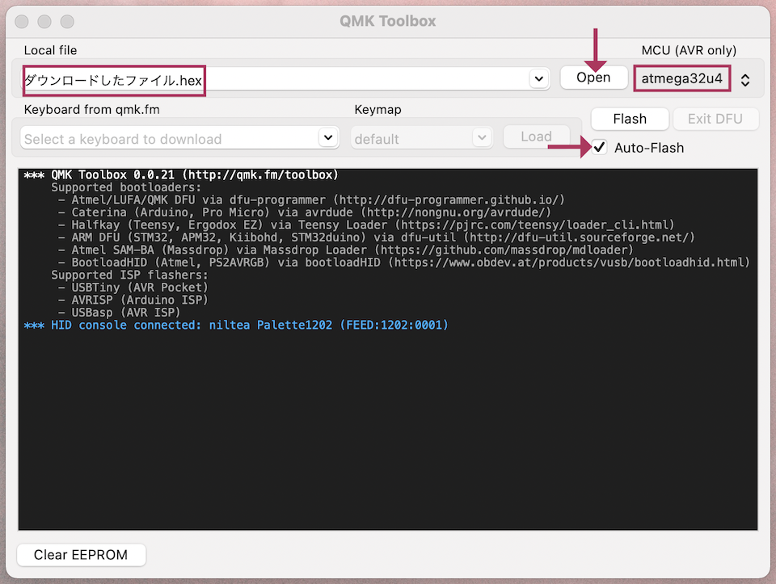

# Pop'n Top キーボード ビルドガイド
しおり  
- [組み立て方（はんだ付け）](#組み立て方はんだ付け)
- [動作テスト](#動作テスト)
- [組み立て方（後半）](#組み立て方後半)
- [カスタマイズ](#キーマップの確認変更方法)
- [おまけ](#おまけ)

## キット内容
  
||部品名|数| |
|-|-|-|-|
|1|メインボード|1|黒・大|
|2|ミドルプレート|1|透明・中|
|3|ボトムプレート|1|黒・中|
|4|ボトムプレート|1|透明・小|
|5|ネジ（短）|36|3mm、銀と黒が18個ずつ、もしくは黒36個|
|6|ネジ（長）|24|5mm、銀と黒が12個ずつ、もしくは黒24個|
|7|スペーサー（短）|18|3mm|
|8|スペーサー（長）|12|8mm|
|9|ダイオード|50||
|10|リセットスイッチ|2||
|11|TRRSジャック|2||
|12|ゴム足|4||

## キット以外に必要なもの
|部品名|数| |
|:-|:-|:-|
|Pro Micro コンスルー付き|2|https://shop.yushakobo.jp/products/promicro-spring-pinheader|
|キースイッチ（Kailh Choc V2）|50|https://shop.yushakobo.jp/collections/all-switches/products/kailh-choc-v2|
|キーキャップ（CherryMX互換）|50|[選び方](#キーキャップの選び方)|
|オス-オス ミニプラグケーブル|1|TRSケーブル、TRRSケーブルとしても売られています。|
|Micro USB ケーブル|1|USB2.0 Micro-Bのもの。|

## 必要な工具
|工具名| |
|:-|:-|
|はんだごて||
|はんだごて置き場||
|鉛入りはんだ||
|細いドライバー|1番ドライバー|

## あると便利な工具
|工具名| |
|:-|:-|
|斜めに切ったタイプのこて先||
|温度調節可能なはんだごて|300度-350度前後|
|ピンセット|LEDには必須|
|フラックス|LEDには必須|
|テスター|
|フラックスリムーバー||
|マスキングテープ||
|はんだ吸い取り線||
|リードベンダー||
|ラジオペンチ||

[▲トップに戻る](#Popn-Top-キーボード-ビルドガイド)
## 組み立て方（はんだ付け）
作るのは両方同時でも片方同時でもお好きな方で構いません。

ダイオードの足を曲げて裏から差し込みます。  
ダイオードには向きがあります。三角形の先の棒と黒線を合わせましょう。  
  

表で更に足を曲げて抜けないようにします。  
ダイオードと並行に曲げるとあとでキースイッチに干渉しにくいです。
  

はんだ付けをして足を切ります。  
マスキングテープでダイオードを固定して足を先に切ると綺麗に仕上がります。  
表面実装型を使うと表からは穴しか見えなくなります。  
  

TRRSジャックを裏から差し込み表ではんだ付けします。  
終わったらリセットスイッチを裏から差し込み表ではんだ付けします。  
  

キースイッチを表から差し込み裏ではんだ付けします。  
  

メインボードの裏にコンスルーを挿します。  
コンスルーの窓が高く向きが同じになるように設置します。  
   
取り外せるように、挿すだけではんだ付けはしません。  

コンスルーにPro Microを挿します。TX0, RAW, USBの位置をシルク印刷と合わせましょう。  
そして、Pro Micro側のコンスルーの足を半田付けします。  
   
これでPro Microを抜き差しできるようになりました。  

[▲トップに戻る](#Popn-Top-キーボード-ビルドガイド)

## 動作テスト
電気的な部分が完成したのでPro Microに動作ソフト（ファームウェア）を書き込んで動作確認をしましょう。  
キットとPCをUSBケーブルでつないでください。  
USBからでないと書き込めないので分割キーボードでは左側と右側に同じ手順を繰り返します。  
（Chrome, Edgeが使える場合Pro Micro Web Updaterの方が手順が少ないです。　[Pro Micro Web Updaterを使う場合](#Pro-Micro-Web-Updaterを使う場合) ）

QMK Toolboxをインストールしてテスト用のファームウェアをダウンロードして下さい。  
- QMK Toolbox https://github.com/qmk/qmk_toolbox/releases

- テスト用ファームウェア [popntop_test.hex](https://github.com/Taro-Hayashi/Pop-n-Top/releases/download/untagged-c08742267614e7d3a6a4/popntop_test.hex)

Openを押してダウンロードしたファイルを指定してAuto-Flashにチェックを入れます。  
MCUがatmega32u4になっていることも確認してください。  

キットのリセットスイッチを押すとPro Microが赤く光り自動でファームウェアが書き込まれます。  
正常に書き込まれた場合"Thank you"のメッセージが出ます。  
ファームウェアを更新する時もこの手順で行います。  

エラーが出る場合Auto-Flashのチェックを外し、リセットスイッチを押した後にQMK ToolboxのFlashのボタンを押してください。  
赤く光らない場合リセットボタンのはんだ付けか、テスターがある場合スイッチを押した時に導通するか確認してください。  

書き込めたら全てのキーが反応することを確認してください。  
反応しないキーが一箇所の場合スイッチ、同じ行で複数個の場合ダイオードのはんだを見直してください。  
お疲れ様でした。問題がなければはんだ付けは終了です。

[▲トップに戻る](#Popn-Top-キーボード-ビルドガイド)

## 組み立て方（後半）
Micro-USB端子を抜いてプレートを組付けます。
プレートには向きがあります。アクリルのミドルプレートは割れやすいので気を付けましょう。

ボトムプレート（黒・中）にスペーサー（短）をネジ（短）で取り付けます。
スペーサーが隠れるようにミドルプレートを嵌めます。
組み合わせたものをメインボードの裏からPro Microに重ならないようにネジ（短）で止めます。

ボトムプレート（透明・小）にスペーサー（長）をネジ（長）で取り付けます。
Pro Microを覆うようにネジ（長）で止めます。

キーキャップを取り付けてPCに接続し、ファームウェアを更新します。
Windows用のサンプルファームウェア shotgun_windows.hex
Mac用のサンプルファームウェア shotgun_mac.hex

ゴム足を貼ったら完成です。

[▲トップに戻る](#Popn-Top-キーボード-ビルドガイド)
## キーマップの確認、変更方法
## キースイッチの選び方
## キーキャップの選び方
[▲トップに戻る](#Popn-Top-キーボード-ビルドガイド)
## LEDの取り付け方
## 液晶タブレットに乗せる場合
## BLE Micro Pro, 電池基板、LPME-IO2a対応について
## Pro Micro Web Updaterを使う場合
ファームウェアをダウンロードしてwebサイトにアクセスしてください。
- テスト用ファームウェア [popntop_test.hex](https://github.com/Taro-Hayashi/Pop-n-Top/releases/download/untagged-c08742267614e7d3a6a4/popntop_test.hex)
- Pro Micro Web Updater https://sekigon-gonnoc.github.io/promicro-web-updater/index.html

全てのキーが反応することを確認してください。  
反応しないキーが一箇所の場合スイッチ、同じ行で複数個の場合ダイオードのはんだを見直してください。  
お疲れ様でした。問題がなければはんだ付けは終了です。
[組み立て方（後半）にすすむ](#組み立て方後半)  
[▲トップに戻る](#Popn-Top-キーボード-ビルドガイド)

## おまけ
[▲トップに戻る](#Popn-Top-キーボード-ビルドガイド)
