# Pop'n Top キーボード ビルドガイド
- [キット内容](#キット内容)
- [組み立て方（はんだ付け）](#組み立て方はんだ付け)
- [動作テスト](#動作テスト)
- [組み立て方（後半）](#組み立て方後半)
- [カスタマイズ](#キーマップの確認変更方法)
- [おまけ](#おまけ)

## キット内容
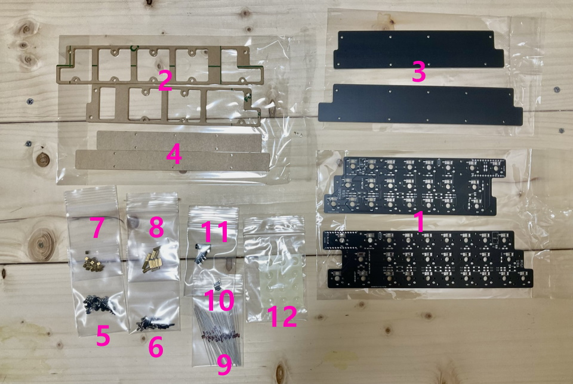  
||部品名|数| |
|-|-|-|-|
|1|メインボード（黒・大）|2|少し短い方が左手用です。|
|2|ミドルプレート（透明・中）|2||
|3|ボトムプレート（黒・中）|2||
|4|ボトムプレート（透明・小）|2||
|5|ネジ（短）|36|3mm|
|6|ネジ（長）|24|5mm|
|7|スペーサー（短）|18|3mm|
|8|スペーサー（長）|12|8mm|
|9|ダイオード|50||
|10|リセットスイッチ|2||
|11|TRRSジャック|2||
|12|ゴム足|12||

## キット以外に必要なもの
|部品名|数|| |
|-|-|-|-|
|Pro Micro コンスルー付き|2||[遊舎工房様販売ページ](https://shop.yushakobo.jp/products/promicro-spring-pinheader)|
|キースイッチ（Kailh Choc V2）|50|[選び方](howtochosekeyswitches.md)|[遊舎工房様販売ページ](https://shop.yushakobo.jp/collections/all-switches/products/kailh-choc-v2)|
|キーキャップ（CherryMX互換）|50|[選び方](howtochosekeycaps.md)||
|TRRSケーブル|1|TRS（ステレオミニ）ケーブルでもいいです。||
|Micro USB ケーブル|1|データ通信対応でUSB2.0 Micro-Bのもの。||

## オプション
|部品名|数|||
|-|-|-|-|
|SK6812MINI-E|50|光らせる場合。[取り付け方](led.md)|[遊舎工房様販売ページ](https://shop.yushakobo.jp/products/sk6812mini-e-10)|
|WS2812B|9|無くてもバックライトだけ光ります。|[遊舎工房様販売ページ](https://shop.yushakobo.jp/products/a0800ws-01-10)|
|1N4148W|50|表面実装タイプのダイオード|[遊舎工房様販売ページ](https://shop.yushakobo.jp/products/a0800di-02-100)|
|両面テープ||ねじの頭の0.5㎜より厚いものがおすすめです。||
 
## 必要な工具
|工具名| |
|-|-|
|はんだごて||
|はんだごて置き場||
|鉛入りはんだ||
|細いドライバー|+の1番ドライバー。|
|ニッパー等ダイオードの足を切れるもの|金属用でない場合刃こぼれします。|
|Microsoft Edge、もしくはGoogle Chrome||

## あると便利な工具
|工具名||
|-|-|
|耐熱シリコンマット||
|斜めに切ったタイプのこて先||
|温度調節可能なはんだごて|300度-350度前後|
|ピンセット|LEDには必須|
|フラックス|LEDには必須|
|テスター||
|フラックスリムーバー||
|マスキングテープ||
|はんだ吸い取り線||
|リードベンダー||

## 組み立て方（はんだ付け）
正しくはんだ付けが終わるとこのようになります。  
 

はんだ付けのやり方は動画で見るとわかりやすいです。  
パーツは思ったより壊れないので落ち着いて作業すると失敗しにくいです。
 - ホームセンターのDCMさんの解説動画(58秒～) https://www.youtube.com/watch?v=JFQg_ObITYE&t=58s
  
  
それではダイオードを、左手用はD1からD23まで右手用はD1からD27まで取り付けます。  
足を曲げて裏から差し込みます。  
ダイオードには向きがあります。三角形の先の棒と黒線を合わせましょう。  
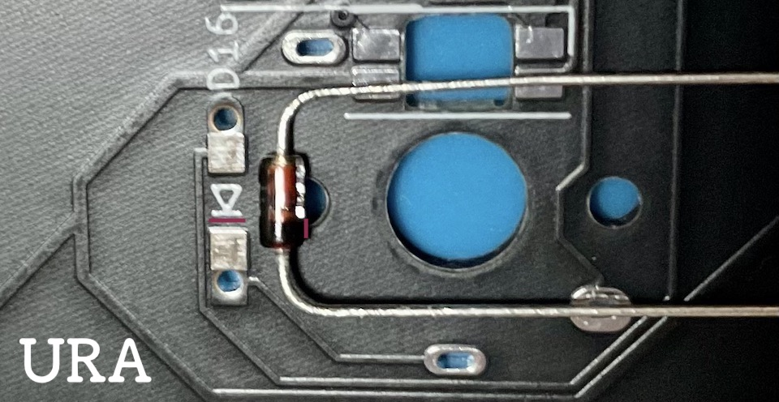  

表で更に足を曲げて抜けないようにします。  
ダイオードと並行に曲げるとあとでキースイッチに干渉しにくいです。
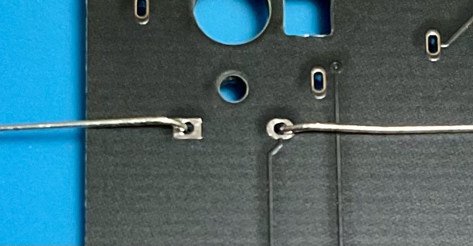  

はんだ付けをして足を切ります。  
マスキングテープでダイオードを固定して足を先に切ると綺麗に仕上がります。  
表面実装型を使うと表からは穴しか見えなくなります。  
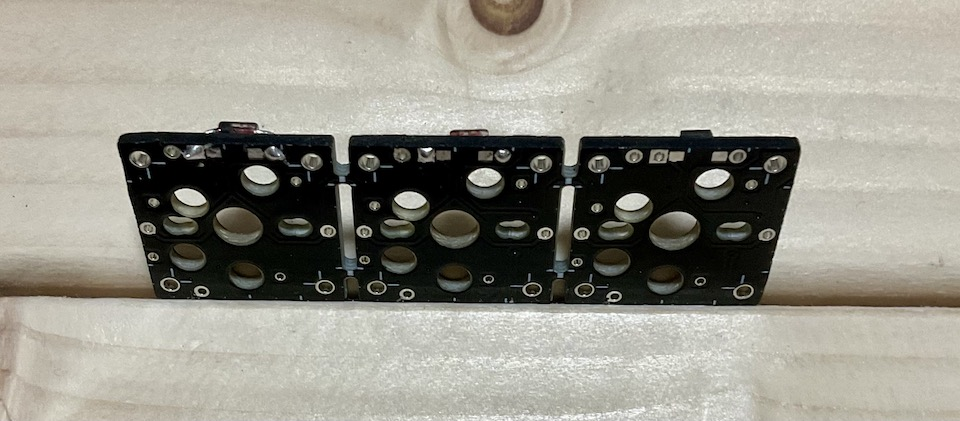  

TRRSジャックを裏から差し込み表ではんだ付けします。  
終わったらリセットスイッチを裏から差し込み表ではんだ付けします。  
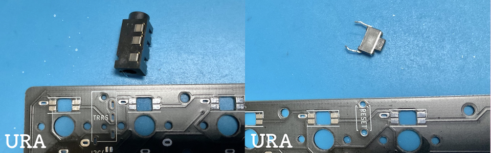  

キースイッチを表から差し込み裏ではんだ付けします。  
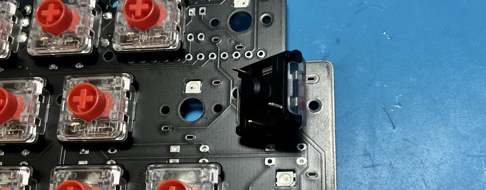  

メインボードの裏にコンスルーを挿します。  
コンスルーの窓が高くて両方とも同じ向きになるように設置します。  
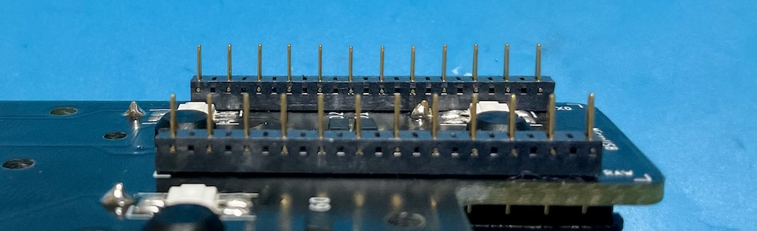   
挿すだけではんだ付けはしません。  

コンスルーにPro Microを挿します。TX0, RAW, USBの位置をシルク印刷と合わせましょう。  
そして、Pro Micro側のコンスルーの足を半田付けします。  
   
これでPro Microを抜き差しできるようになりました。  
両手分作り終えたら次に進んでください。  

## 動作テスト
Pro Microに動作ソフト（ファームウェア）を書き込んで動作確認をしましょう。  
左手用とPCをUSBケーブルでつないでください。   

ファームウェアをダウンロードしてEdgeかChromeでPro Micro Web Updaterにアクセスしてください。
- テスト用ファームウェア [popntop_test.hex](https://github.com/Taro-Hayashi/Pop-n-Top/releases/download/1.0/popntop_leftconnected_test.hex)
- Pro Micro Web Updater https://sekigon-gonnoc.github.io/promicro-web-updater/index.html

ファイルの選択ボタンを押してダウンロードしたファームウェアを指定したら、flashボタンを押しましょう。  
  

ブラウザのアドレスバーからメッセージが出てきたら、キットのリセットスイッチを押します。      
すると選択欄にArduino Microが出てきてクリックできるようになります。  
  

選択して接続を押すと書き込みが終わります。  
  
ファームウェアを更新する時もこの手順で行います。  

USBで接続しないと書き込めないので分割キーボードでは左手用と右手用に同じ手順を繰り返します。  
右手用にも同じファームウェアを書き込んでください。  

書き込めたら一度USBケーブルを外し、TRRSケーブルで左右を繋げます。  
（TRRSケーブルを抜き差しするときはPCとは接続しない方が安全だそうです。）  
左手用とPCをUSBケーブルで接続してタイプすると1-50の数字が打てるはずです。     

お疲れ様でした。問題がなければはんだ付けは終了です。

## 組み立て方（後半）
USBケーブル、TRRSケーブルを抜いてプレートを組付けます。  
アクリルからは保護フィルムを剥がしてください。割れやすいので気をつけましょう。  

メインボード裏面の赤丸の箇所にスペーサー（短）をネジ（短）で取り付けてミドルプレート（透明・中）を嵌めます。
  
ボトムプレート（黒・中）をネジ（短）で止めます。  
  
メインボードの残ったネジ穴にスペーサー（長）をネジ（長）で取り付け、ボトムプレート（透明・小）をネジ（長）で止めます。  
   

キーキャップを取り付けたら本番用のファームウェアに更新しましょう。
- [popntop_via.hex](https://github.com/Taro-Hayashi/Pop-n-Top/releases/download/1.0/popntop_leftconnected_via.hex)

ゴム足を貼ってTRRSケーブルで左右を繋いだら完成です。
  
USBケーブルは左手用に接続してください。  

## キーマップの確認、変更方法
このキットはレイヤー機能を使っています。  

[Keyboard Layout Editor で見る](http://www.keyboard-layout-editor.com/##@_backcolor=#fffffff&name=Layout%20-%20Pop'n%20Top%20KEYBOARD%20US&author=T.Hayashi;&@_c=#777777&a:7;&=&_c=#aaaaaa&w:1.5;&=&_c=#cf7e7e;&=!&=/@&=#&=$&=%25&_st=PG151101D05//D43;&=~&_x:3&c=#cccccc;&=&_c=#cf7e7e;&=F1&=F2&=F3&=F4&=F5&=F6&_c=#cccccc;&=&_c=#cf7e7e&w:2;&=Delete;&@_x:0.75&c=#aaaaaa&w:1.75;&=&_c=#cf7e7e;&=%5E&=/&&=*&_n:true;&=(&=)&_c=#aaaaaa&w:1.5;&=&_x:2&w:1.5;&=&_c=#cf7e7e;&=F7&_n:true;&=F8&=F9&=F10&=F11&=F12&_c=#d99393&w:2;&=↑;&@_x:0.5&c=#aaaaaa&w:2;&=&_c=#cccccc;&=&=&=&=&=&_c=#cf7e7e;&=&_c=#aaaaaa;&=&_x:1;&=&=&_c=#cccccc;&=&=&=&=&=&_c=#d99393;&=←&_w:1.75;&=↓&_fa@:2;;&=→;&@_y:-0.25&x:8.75&c=#cccccc&t=#c91818&a:5&f:3&w:2.5&d:true;&=↑%0AUPPER%20LAYER;&@_y:-0.25&c=#777777&t=#000000%0A#dbbc1f&f2:2;&=esc%0A長押しRGB&_c=#aaaaaa&t=#000000&a:7&w:1.5;&=Tab&_c=#cccccc;&=Q&=W&=E&=R&=T&_a:5&f:3;&=/_%0A%0A%0A%0A%0A%0A-&_x:3&f:3;&=+%0A%0A%0A%0A%0A%0A/=&_a:7;&=Y&=U&=I&=O&=P&_a:5&f:3;&=%7B%0A%0A%0A%0A%0A%0A%5B&_f:3;&=%7D%0A%0A%0A%0A%0A%0A%5D&_c=#aaaaaa&a:7&w:2;&=Backspace;&@_x:0.75&w:1.75;&=Control&_c=#cccccc;&=A&=S&=D&_n:true;&=F&=G&_c=#aaaaaa&w:1.5;&=Space&_x:2&w:1.5;&=Space&_c=#cccccc;&=H&_n:true;&=J&=K&=L&_a:5&f:3;&=/:%0A%0A%0A%0A%0A%0A/;&_f:3;&=%22%0A%0A%0A%0A%0A%0A'&_c=#aaaaaa&a:7&w:2;&=Enter;&@_x:0.5&w:2;&=Shift&_c=#cccccc;&=Z&=X&=C&=V&=B&_c=#aaaaaa&t=#c91818&a:5&fa@:2;;&=UPPER&_t=#000000&fa@:2&:1;;&=Space%0A長押し%20Alt&_x:1&f2:1;&=Space%0A長押し%20Win&_t=#000000%0A#152bab&f2:2;&=%0ALOWER&_c=#cccccc&t=#000000&a:7&fa@:2;;&=N&=M&_a:5&f:3;&=%3C%0A%0A%0A%0A%0A%0A,&_f:3;&=%3E%0A%0A%0A%0A%0A%0A.&_f:3;&=?%0A%0A%0A%0A%0A%0A//&_f:3;&=%7C%0A%0A%0A%0A%0A%0A%5C&_c=#aaaaaa&a:7&f:3&w:1.75;&=Shift&_a:5&fa@:2&:1&:0&:0&:0&:0&:2;;&=%0A(alt+%60)%0A%0A%0A%0A%0AIME切り替え;&@_x:8.75&c=#cccccc&t=#152bab#1d2c8c%0A#152bab&f:3&w:2.5&d:true;&=LOWER%E3%80%80LAYER%0A↓;&@_y:-0.5&c=#777777&t=#000000&a:7;&=&_c=#aaaaaa&w:1.5;&=&_c=#8792d6&a:5&f:3;&=!%0A%0A%0A%0A%0A%0A1&_f:3;&=/@%0A%0A%0A%0A%0A%0A2&_f:3;&=#%0A%0A%0A%0A%0A%0A3&_f:3;&=$%0A%0A%0A%0A%0A%0A4&_f:3;&=%25%0A%0A%0A%0A%0A%0A5&_f:3;&=~%0A%0A%0A%0A%0A%0A%60&_x:3&c=#cccccc&a:7;&=&=&=&=&=&=&_c=#8792d6&f:3;&=(&_f:3;&=)&_c=#aaaaaa&w:2;&=;&@_x:0.75&w:1.75;&=&_c=#8792d6&a:5&f:3;&=%5E%0A%0A%0A%0A%0A%0A6&_f:3;&=/&%0A%0A%0A%0A%0A%0A7&_f:3;&=*%0A%0A%0A%0A%0A%0A8&_f:3&n:true;&=(%0A%0A%0A%0A%0A%0A9&_f:3;&=)%0A%0A%0A%0A%0A%0A0&_c=#aaaaaa&a:7&w:1.5;&=&_x:2&w:1.5;&=&_c=#8792d6&f:3;&=←&_f:3&n:true;&=↓&_f:3;&=↑&_f:3;&=→&_c=#cccccc;&=&=&_c=#aaaaaa&w:2;&=;&@_x:0.5&w:2;&=&_c=#cccccc;&=&=&=&=&=&_c=#aaaaaa;&=&=&_x:1;&=&_c=#8792d6;&=&_c=#cccccc;&=&=&=&=&=&=&_c=#aaaaaa&f:3&w:1.75;&=shift&=;&@_y:0.75&c=#e0cb58;&=&_c=#aaaaaa&w:1.5;&=&_c=#e0cb58&f:3;&=色相+&_f:3;&=彩度+&_f:3;&=明度+&_fa@:1;;&=スピード+&_c=#cccccc;&=&=&_x:0.25&t=#a18806&a:5&f:3&w:2.5&d:true;&=RGB%20LAYER&_x:0.25&t=#000000&a:7;&=&=&=&=&=&=&=&=&_c=#aaaaaa&w:2;&=;&@_x:1&c=#e0cb58&fa@:2;&w:1.5;&=前のパターン&_c=#cccccc;&=&=&=&_n:true;&=&=&_c=#e0cb58&w:2;&=次のパターン&_x:1.5&c=#aaaaaa&w:1.5;&=&_c=#cccccc;&=&_n:true;&=&=&=&=&=&_c=#aaaaaa&w:2;&=;&@_x:0.5&w:2;&=&_c=#e0cb58&f:3;&=色相-&_f:3;&=彩度-&_f:3;&=明度-&_fa@:1;;&=スピード%20-&_c=#cccccc;&=&_c=#aaaaaa;&=&_c=#e0cb58&fa@:2;;&=ON//OFF&_x:1&c=#aaaaaa;&=&_c=#cccccc;&=&=&=&=&=&=&=&_c=#aaaaaa&w:1.75;&=&=)  
  
使わないキーを削除したり使用頻度の高いキーを押しやすい位置に変更してみましょう。  
  
  ChromeかEdgeでRemapにアクセスしてください。  
- Remap https://remap-keys.app/  
  
  
左を選んで進んでいくとアドレスバーからメッセージが出てキーボードを選択できます。

キーの変更が終わったら右上のflashボタンを押すと反映されます。  
  
  
上手くいかなくなったときはいったんリセットすると直ることがあります。  
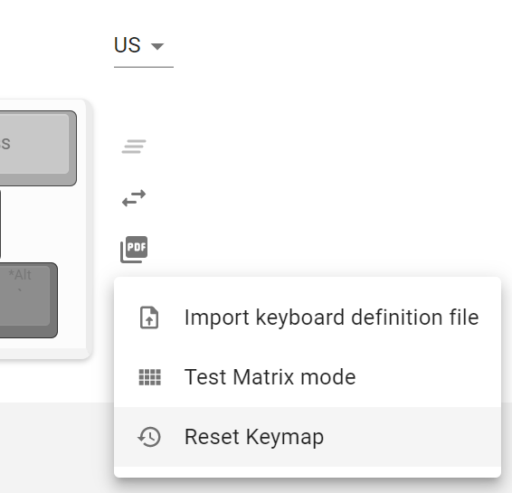  
  
Mac用レイアウトのファームウェアも用意したのでよかったら手間を省くのに使ってください。  
- Mac用 [Keyboard Layout Editor で見る](http://www.keyboard-layout-editor.com/##@_backcolor=#ffffff&name=Layout%20-%20Pop'n%20Top%20KEYBOARD%20Mac&author=T.Hayashi;&@_c=#777777&a:7;&=&_c=#aaaaaa&w:1.5;&=&_c=#cf7e7e;&=!&=/@&=#&=$&=%25&_st=PG151101D05//D43;&=~&_x:3&c=#cccccc;&=&_c=#cf7e7e;&=F1&=F2&=F3&=F4&=F5&=F6&_c=#cccccc;&=&_c=#aaaaaa&w:2;&=;&@_x:0.75&w:1.75;&=&_c=#cf7e7e;&=%5E&=/&&=*&_n:true;&=(&=)&_c=#aaaaaa&w:1.5;&=&_x:2&w:1.5;&=&_c=#cf7e7e;&=F7&_n:true;&=F8&=F9&=F10&=F11&=F12&_c=#d99393&w:2;&=%E2%86%91;&@_x:0.5&c=#aaaaaa&w:2;&=&_c=#cccccc;&=&=&=&=&=&_c=#cf7e7e;&=&_c=#aaaaaa;&=&_x:1;&=&=&_c=#cccccc;&=&=&=&=&=&_c=#d99393;&=%E2%86%90&_w:1.75;&=%E2%86%93&_fa@:2;;&=%E2%86%92;&@_y:-0.25&x:8.75&c=#cccccc&t=#c91818&a:5&f:3&w:2.5&d:true;&=%E2%86%91%0AUPPER%20LAYER;&@_y:-0.25&c=#777777&t=#000000%0A#dbbc1f&f2:2;&=esc%0A%E9%95%B7%E6%8A%BC%E3%81%97RGB&_c=#aaaaaa&t=#000000&a:7&w:1.5;&=tab&_c=#cccccc;&=Q&=W&=E&=R&=T&_a:5&f:3;&=/_%0A%0A%0A%0A%0A%0A-&_x:3&f:3;&=+%0A%0A%0A%0A%0A%0A/=&_a:7;&=Y&=U&=I&=O&=P&_a:5&f:3;&=%7B%0A%0A%0A%0A%0A%0A%5B&_f:3;&=%7D%0A%0A%0A%0A%0A%0A%5D&_c=#aaaaaa&a:7&w:2;&=delete;&@_x:0.75&w:1.75;&=command&_c=#cccccc;&=A&=S&=D&_n:true;&=F&=G&_c=#aaaaaa&w:1.5;&=space&_x:2&w:1.5;&=space&_c=#cccccc;&=H&_n:true;&=J&=K&=L&_a:5&f:3;&=/:%0A%0A%0A%0A%0A%0A/;&_f:3;&=%22%0A%0A%0A%0A%0A%0A'&_c=#aaaaaa&a:7&w:2;&=return;&@_x:0.5&w:2;&=shift&_c=#cccccc;&=Z&=X&=C&=V&=B&_c=#aaaaaa&t=#c91818%0A#000000&a:5&fa@:2;;&=%E9%95%B7%E6%8A%BC%E3%81%97UPPER%0A%E8%8B%B1%E6%95%B0&_t=#000000&fa@:2&:1;;&=space%0A%E9%95%B7%E6%8A%BC%E3%81%97%20option&_x:1;&=space%0A%E9%95%B7%E6%8A%BC%E3%81%97%20ctrl&_t=#000000%0A#152bab&fa@:2&:2;;&=%E3%81%8B%E3%81%AA%0A%E9%95%B7%E6%8A%BC%E3%81%97LOWER&_c=#cccccc&t=#000000&a:7;&=N&=M&_a:5&f:3;&=%3C%0A%0A%0A%0A%0A%0A,&_f:3;&=%3E%0A%0A%0A%0A%0A%0A.&_f:3;&=?%0A%0A%0A%0A%0A%0A//&_f:3;&=%7C%0A%0A%0A%0A%0A%0A%5C&_c=#aaaaaa&a:7&f:3&w:1.75;&=shift&_f:3;&=caps%20lock;&@_x:8.75&c=#cccccc&t=#152bab#1d2c8c%0A#152bab&a:5&f:3&w:2.5&d:true;&=LOWER%E3%80%80LAYER%0A%E2%86%93;&@_y:-0.5&c=#777777&t=#000000&a:7;&=&_c=#aaaaaa&w:1.5;&=&_c=#8792d6&a:5&f:3;&=!%0A%0A%0A%0A%0A%0A1&_f:3;&=/@%0A%0A%0A%0A%0A%0A2&_f:3;&=#%0A%0A%0A%0A%0A%0A3&_f:3;&=$%0A%0A%0A%0A%0A%0A4&_f:3;&=%25%0A%0A%0A%0A%0A%0A5&_f:3;&=~%0A%0A%0A%0A%0A%0A%60&_x:3&c=#cccccc&a:7;&=&=&=&=&=&=&_c=#8792d6&f:3;&=(&_f:3;&=)&_c=#aaaaaa&w:2;&=;&@_x:0.75&w:1.75;&=&_c=#8792d6&a:5&f:3;&=%5E%0A%0A%0A%0A%0A%0A6&_f:3;&=/&%0A%0A%0A%0A%0A%0A7&_f:3;&=*%0A%0A%0A%0A%0A%0A8&_f:3&n:true;&=(%0A%0A%0A%0A%0A%0A9&_f:3;&=)%0A%0A%0A%0A%0A%0A0&_c=#aaaaaa&a:7&w:1.5;&=&_x:2&w:1.5;&=&_c=#8792d6&f:3;&=%E2%86%90&_f:3&n:true;&=%E2%86%93&_f:3;&=%E2%86%91&_f:3;&=%E2%86%92&_c=#cccccc;&=&=&_c=#aaaaaa&w:2;&=;&@_x:0.5&w:2;&=&_c=#cccccc;&=&=&=&=&=&_c=#aaaaaa;&=&=&_x:1;&=&_c=#8792d6;&=&_c=#cccccc;&=&=&=&=&=&=&_c=#aaaaaa&f:3&w:1.75;&=shift&=;&@_y:0.75&c=#e0cb58;&=&_c=#aaaaaa&w:1.5;&=&_c=#e0cb58&f:3;&=%E8%89%B2%E7%9B%B8+&_f:3;&=%E5%BD%A9%E5%BA%A6+&_f:3;&=%E6%98%8E%E5%BA%A6+&_fa@:1;;&=%E3%82%B9%E3%83%94%E3%83%BC%E3%83%89+&_c=#cccccc;&=&=&_x:0.25&t=#a18806&a:5&f:3&w:2.5&d:true;&=RGB%20LAYER&_x:0.25&t=#000000&a:7;&=&=&=&=&=&=&=&=&_c=#aaaaaa&w:2;&=;&@_x:1&c=#e0cb58&fa@:2;&w:1.5;&=%E5%89%8D%E3%81%AE%E3%83%91%E3%82%BF%E3%83%BC%E3%83%B3&_c=#cccccc;&=&=&=&_n:true;&=&=&_c=#e0cb58&w:2;&=%E6%AC%A1%E3%81%AE%E3%83%91%E3%82%BF%E3%83%BC%E3%83%B3&_x:1.5&c=#aaaaaa&w:1.5;&=&_c=#cccccc;&=&_n:true;&=&=&=&=&=&_c=#aaaaaa&w:2;&=;&@_x:0.5&w:2;&=&_c=#e0cb58&f:3;&=%E8%89%B2%E7%9B%B8-&_f:3;&=%E5%BD%A9%E5%BA%A6-&_f:3;&=%E6%98%8E%E5%BA%A6-&_fa@:1;;&=%E3%82%B9%E3%83%94%E3%83%BC%E3%83%89%20-&_c=#cccccc;&=&_c=[]#aaaaaa;&=&_c=#e0cb58&fa@:2;;&=ON//OFF&_x:1&c=#aaaaaa;&=&_c=#cccccc;&=&=&=&=&=&=&=&_c=#aaaaaa&w:1.75;&=&=)  
[popntop_mac.hex](https://github.com/Taro-Hayashi/Pop-n-Top/releases/download/1.0/popntop_leftconnected_mac.hex)  
  
## 液晶タブレットに乗せる場合
1番上の行を引っ掛ける事で液タブに乗せる事ができます。  
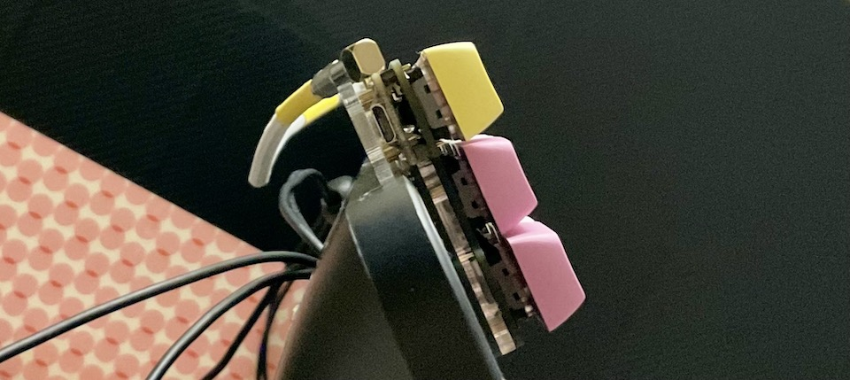  
ゴム足を外して両面テープで固定すると安定します。  
跡が残るといけないので画面には保護フィルムを貼ってください。  

## おまけ
寸法です。ダンボールで作れるペーパークラフトもあります。
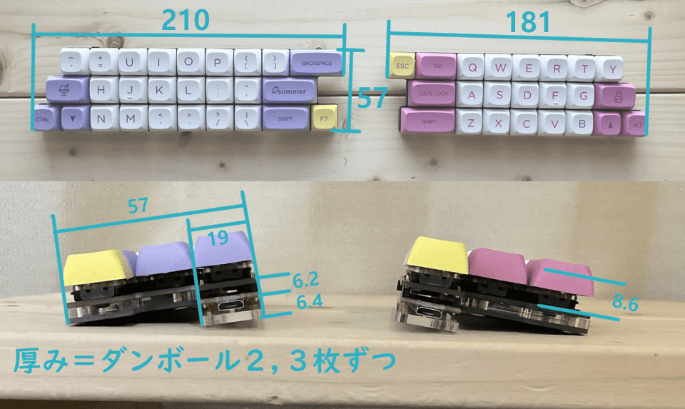　　
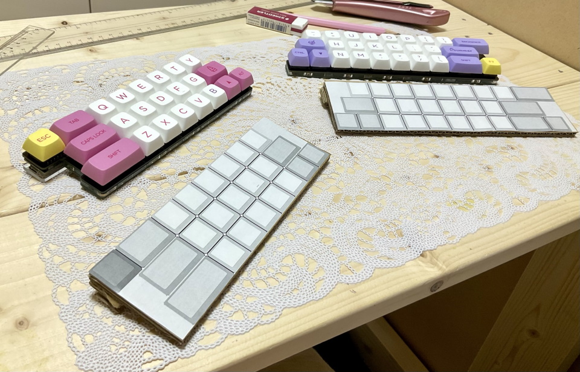　　
- [realsizeA4.pdf](https://github.com/Taro-Hayashi/Pop-n-Top/releases/download/1.0/realsizeA4.pdf)  
- ネットプリント番号: SD9TTJJF  8/12まで　　

A4サイズです。定規があればプリントしなくても作れます。

ファームウェアのフォルダ  
https://github.com/Taro-Hayashi/qmk_firmware/tree/master/keyboards/popntop  
  
VIA用のJSONファイル [popntop.json](https://github.com/Taro-Hayashi/Pop-n-Top/releases/download/1.0/popntop.json)  
  
ミドル、ボトムプレートのデザインデータ  
[popntop_plates.zip](https://github.com/Taro-Hayashi/Pop-n-Top/releases/download/1.0/popntop_plates.zip)  
発注先のルールに沿ってデータを修正してください。  
  
ご不明な点があればBOOTHのメッセージかtwitterのリプライでいつでも聞いてください。  
販売ページ: https://tarohayashi.booth.pm/items/3154435
  
foostan様のフットプリントを流用、改変して使わせていただきました。  
https://github.com/foostan/kbd/  
https://github.com/foostan/kbd/blob/master/LICENSE  
