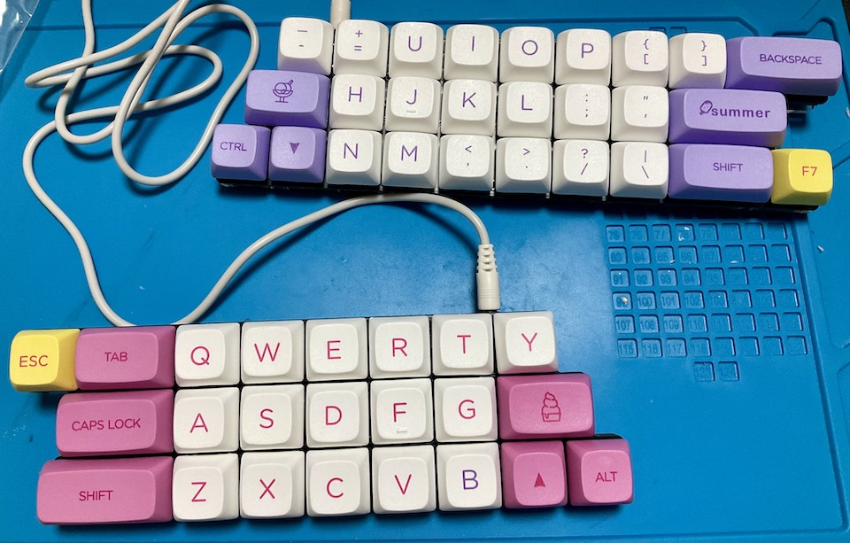
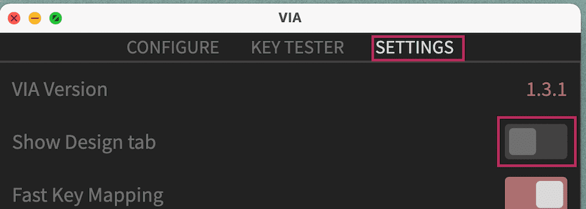
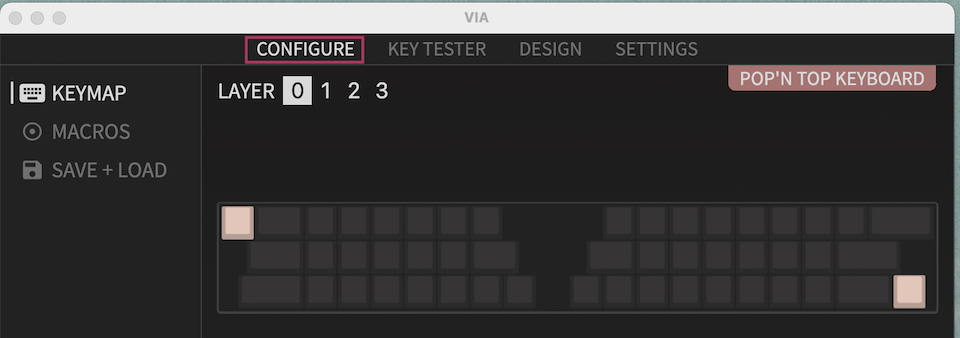

# Pop'n Top キーボード ビルドガイド
- [キット内容](#キット内容)
- [組み立て方（はんだ付け）](#組み立て方はんだ付け)
- [動作テスト](#動作テスト)
- [組み立て方（後半）](#組み立て方後半)
- [カスタマイズ](#キーマップの確認変更方法)
- [おまけ](#おまけ)

## キット内容
  
||部品名|数| |
|-|-|-|-|
|1|メインボード（黒・大）|2|少し短い方が左です。|
|2|ミドルプレート（透明・中）|2||
|3|ボトムプレート（黒・中）|2||
|4|ボトムプレート（透明・小）|2||
|5|ネジ（短）|36|3mm|
|6|ネジ（長）|24|5mm|
|7|スペーサー（短）|18|3mm|
|8|スペーサー（長）|12|8mm|
|9|ダイオード|50||
|10|リセットスイッチ|2||
|11|TRRSジャック|2||
|12|ゴム足|12||

## キット以外に必要なもの
|部品名|数|| |
|-|-|-|-|
|Pro Micro コンスルー付き|2||[遊舎工房様販売ページ](https://shop.yushakobo.jp/products/promicro-spring-pinheader)|
|キースイッチ（Kailh Choc V2）|50|[選び方](howtochosekeyswitches.md)|[遊舎工房様販売ページ](https://shop.yushakobo.jp/collections/all-switches/products/kailh-choc-v2)|
|キーキャップ（CherryMX互換）|50|[選び方](howtochosekeycaps.md)||
|TRRSケーブル|1|TRS（ステレオミニ）ケーブルでもいいです。||
|Micro USB ケーブル|1|データ通信対応でUSB2.0 Micro-Bのもの。||

## オプション
|部品名|数|||
|-|-|-|-|
|表面実装タイプのダイオード|50||[遊舎工房様販売ページ](https://shop.yushakobo.jp/products/a0800di-02-100)|
|SK6812MINI-E|50|[取り付け方](led.md)|[遊舎工房様販売ページ](https://shop.yushakobo.jp/products/sk6812mini-e-10)|
|WS2812B|9|無くてもバックライトだけ光ります。|[遊舎工房様販売ページ](https://shop.yushakobo.jp/products/a0800ws-01-10)|
|両面テープ||液タブに固定する場合。||
 
## 必要な工具
|工具名| |
|-|-|
|はんだごて||
|はんだごて置き場||
|鉛入りはんだ||
|細いドライバー|+の1番ドライバー。|
|ニッパー等ダイオードの足を切れるもの|金属用でない場合刃こぼれします。|

## あると便利な工具
|工具名||
|-|-|
|耐熱シリコンマット||
|小皿||
|斜めに切ったタイプのこて先||
|温度調節可能なはんだごて|300度-350度前後|
|ピンセット|LEDには必須|
|フラックス|LEDには必須|
|テスター||
|フラックスリムーバー||
|マスキングテープ||
|はんだ吸い取り線||
|リードベンダー||
|ラジオペンチ||

## 組み立て方（はんだ付け）
ダイオードの足を曲げて裏から差し込みます。  
ダイオードには向きがあります。三角形の先の棒と黒線を合わせましょう。  
  

表で更に足を曲げて抜けないようにします。  
ダイオードと並行に曲げるとあとでキースイッチに干渉しにくいです。
  

はんだ付けをして足を切ります。  
マスキングテープでダイオードを固定して足を先に切ると綺麗に仕上がります。  
表面実装型を使うと表からは穴しか見えなくなります。  
  

TRRSジャックを裏から差し込み表ではんだ付けします。  
終わったらリセットスイッチを裏から差し込み表ではんだ付けします。  
  

キースイッチを表から差し込み裏ではんだ付けします。  
  

メインボードの裏にコンスルーを挿します。  
コンスルーの窓が高くて両方とも同じ向きになるように設置します。  
   
挿すだけではんだ付けはしません。  

コンスルーにPro Microを挿します。TX0, RAW, USBの位置をシルク印刷と合わせましょう。  
そして、Pro Micro側のコンスルーの足を半田付けします。  
   
これでPro Microを抜き差しできるようになりました。  
両手分作り終えたら次に進んでください。  

## 動作テスト
Pro Microに動作ソフト（ファームウェア）を書き込んで動作確認をしましょう。  
左手用とPCをUSBケーブルでつないでください。   

Chrome, Edgeを使っているならPro Micro Web Updaterだとブラウザだけでファームウェアを書き込めます。  
[Pro Micro Web Updaterを使う場合](promicrowebupdater.md)  

使わない場合、QMK Toolboxをインストールしてテスト用のファームウェアをダウンロードして下さい。  
- QMK Toolbox https://github.com/qmk/qmk_toolbox/releases
- テスト用ファームウェア [popntop_test.hex](https://github.com/Taro-Hayashi/Pop-n-Top/releases/download/untagged-6f31185aea07d10a6589/popntop_test.hex)

Openを押してダウンロードしたファイルを指定してAuto-Flashにチェックを入れます。  
MCUがatmega32u4になっていることも確認します。  

　　
キットのリセットスイッチを押すとPro Microが赤く光り自動でファームウェアが書き込まれます。  
"Thank you"のメッセージが出たら書き込み完了です。
  
（エラーが出る場合Auto-Flashのチェックを外し、先にリセットスイッチを押してQMK ToolboxのFlashのボタンを押してみてください。）  

ファームウェアを更新する時もこの手順で行います。  

USBで接続しないと書き込めないので分割キーボードでは左手用と右手用に同じ手順を繰り返します。
右手用にも同じファームウェアを書き込んでください。  

書き込めたら一度USBケーブルを外し、TRRSケーブルで左右を繋げます。  
（TRRSケーブルを抜き差しするときはPCとは接続しない方が安全だそうです。）  
左手用とPCをUSBケーブルで接続してタイプすると1-50の数字が打てるはずです。  
反応しないキーが一箇所の場合スイッチ、同じ行で複数個の場合ダイオードのはんだが原因だと思います。   

お疲れ様でした。問題がなければはんだ付けは終了です。

## 組み立て方（後半）
USBケーブル、TRRSケーブルを抜いてプレートを組付けます。  
プレートには向きがあります。アクリルからは保護フィルムを剥がしてください。割れやすいので気をつけましょう。  

ボトムプレート（黒・中）にスペーサー（短）をネジ（短）で取り付けます。  
スペーサーが隠れるようにミドルプレートを嵌めます。  
  

組み合わせたものをメインボードの裏からPro Microに重ならないようにネジ（短）で止めます。   
  

ボトムプレート（透明・小）にスペーサー（長）をネジ（長）で取り付けます。  
Pro Microを覆うようにネジ（長）で止めます。  
   

キーキャップを取り付けたら本番用のファームウェアに更新しましょう。
- [popntop_via.hex](https://github.com/Taro-Hayashi/Pop-n-Top/releases/download/untagged-6f31185aea07d10a6589/popntop_via.hex)

ゴム足を貼ってTRRSケーブルで左右を繋いだら完成です。
  
USBケーブルは左手用に接続してください。  

## キーマップの確認、変更方法
このキットはレイヤー機能を使っています。

[Keyboard Layout Editor で見る](http://www.keyboard-layout-editor.com/##@_backcolor=#ffffff&name=Layout%20-%20Pop'n%20Top%20KEYBOARD&author=T.Hayashi&switchMount=cherry&switchBrand=kailh&switchType=PG151101D05//D43&pcb:true;&@_c=#777777&a:7;&=&_c=#aaaaaa&w:1.5;&=&_c=#cf7e7e;&=!&=/@&=#&=$&=%25&_st=PG151101D05//D43;&=~&_x:3&c=#cccccc;&=&_c=#cf7e7e;&=F1&=F2&=F3&=F4&=F5&=F6&_c=#cccccc;&=&_c=#cf7e7e&w:2;&=delete;&@_x:0.75&c=#aaaaaa&w:1.75;&=&_c=#cf7e7e;&=%5E&=/&&=*&_n:true;&=(&=)&_c=#aaaaaa&w:1.5;&=&_x:2&w:1.5;&=&_c=#cf7e7e;&=F7&_n:true;&=F8&=F9&=F10&=F11&=F12&_c=#d99393&w:2;&=↑;&@_x:0.5&c=#aaaaaa&w:2;&=&_c=#cccccc;&=&=&=&=&=&_c=#cf7e7e;&=&_c=#aaaaaa;&=&_x:1;&=&=&_c=#cccccc;&=&=&=&=&=&_c=#d99393;&=←&_w:1.75;&=↓&_fa@:2;;&=→;&@_y:-0.25&x:8.75&c=#cccccc&t=#c91818&a:5&f:3&w:2.5&d:true;&=↑%0AUPPER%20LAYER;&@_y:-0.25&c=#777777&t=#000000%0A#dbbc1f&f2:2;&=esc%0A長押しRGB&_c=#aaaaaa&t=#000000&a:7&w:1.5;&=tab&_c=#cccccc;&=Q&=W&=E&=R&=T&_a:5&f:3;&=/_%0A%0A%0A%0A%0A%0A-&_x:3&f:3;&=+%0A%0A%0A%0A%0A%0A/=&_a:7;&=Y&=U&=I&=O&=P&_a:5&f:3;&=%7B%0A%0A%0A%0A%0A%0A%5B&_f:3;&=%7D%0A%0A%0A%0A%0A%0A%5D&_c=#aaaaaa&a:7&w:2;&=backspace;&@_x:0.75&w:1.75;&=control&_c=#cccccc;&=A&=S&=D&_n:true;&=F&=G&_c=#aaaaaa&w:1.5;&=space&_x:2&w:1.5;&=space&_c=#cccccc;&=H&_n:true;&=J&=K&=L&_a:5&f:3;&=/:%0A%0A%0A%0A%0A%0A/;&_f:3;&=%22%0A%0A%0A%0A%0A%0A'&_c=#aaaaaa&a:7&w:2;&=enter;&@_x:0.5&w:2;&=shift&_c=#cccccc;&=Z&=X&=C&=V&=B&_c=#aaaaaa&t=#c91818%0A#000000&a:5&fa@:2;;&=長押しUPPER%0A英数&_t=#000000&fa@:2&:1;;&=space%0A長押しWin//cmd&_x:1;&=space%0A長押しWIN//CMD&_t=#000000%0A#152bab&fa@:2&:2;;&=かな%0A長押しLOWER&_c=#cccccc&t=#000000&a:7;&=N&=M&_a:5&f:3;&=%3C%0A%0A%0A%0A%0A%0A,&_f:3;&=%3E%0A%0A%0A%0A%0A%0A.&_f:3;&=?%0A%0A%0A%0A%0A%0A//&_f:3;&=%7C%0A%0A%0A%0A%0A%0A%5C&_c=#aaaaaa&a:7&f:3&w:1.75;&=shift&_f:3;&=alt;&@_x:8.75&c=#cccccc&t=#152bab#1d2c8c%0A#152bab&a:5&f:3&w:2.5&d:true;&=LOWER%E3%80%80LAYER%0A↓;&@_y:-0.5&c=#777777&t=#000000&a:7;&=&_c=#aaaaaa&w:1.5;&=&_c=#8792d6&a:5&f:3;&=!%0A%0A%0A%0A%0A%0A1&_f:3;&=/@%0A%0A%0A%0A%0A%0A2&_f:3;&=#%0A%0A%0A%0A%0A%0A3&_f:3;&=$%0A%0A%0A%0A%0A%0A4&_f:3;&=%25%0A%0A%0A%0A%0A%0A5&_f:3;&=~%0A%0A%0A%0A%0A%0A%60&_x:3&c=#cccccc&a:7;&=&=&=&=&=&=&_c=#8792d6&f:3;&=(&_f:3;&=)&_c=#aaaaaa&w:2;&=;&@_x:0.75&w:1.75;&=&_c=#8792d6&a:5&f:3;&=%5E%0A%0A%0A%0A%0A%0A6&_f:3;&=/&%0A%0A%0A%0A%0A%0A7&_f:3;&=*%0A%0A%0A%0A%0A%0A8&_f:3&n:true;&=(%0A%0A%0A%0A%0A%0A9&_f:3;&=)%0A%0A%0A%0A%0A%0A0&_c=#aaaaaa&a:7&w:1.5;&=&_x:2&w:1.5;&=&_c=#8792d6&f:3;&=←&_f:3&n:true;&=↓&_f:3;&=↑&_f:3;&=→&_c=#cccccc;&=&=&_c=#aaaaaa&w:2;&=;&@_x:0.5&w:2;&=&_c=#cccccc;&=&=&=&=&=&_c=#aaaaaa;&=&=&_x:1;&=&_c=#8792d6;&=&_c=#cccccc;&=&=&=&=&=&=&_c=#aaaaaa&f:3&w:1.75;&=shift&=;&@_y:0.75&c=#e0cb58;&=&_c=#aaaaaa&w:1.5;&=&_c=#e0cb58&f:3;&=色相+&_f:3;&=彩度+&_f:3;&=明度+&_fa@:1;;&=スピード+&_c=#cccccc;&=&=&_x:0.25&t=#a18806&a:5&f:3&w:2.5&d:true;&=RGB%20LAYER&_x:0.25&t=#000000&a:7;&=&=&=&=&=&=&=&=&_c=#aaaaaa&w:2;&=;&@_x:1&c=#e0cb58&fa@:2;&w:1.5;&=前のパターン&_c=#cccccc;&=&=&=&_n:true;&=&=&_c=#e0cb58&w:2;&=次のパターン&_x:1.5&c=#aaaaaa&w:1.5;&=&_c=#cccccc;&=&_n:true;&=&=&=&=&=&_c=#aaaaaa&w:2;&=;&@_x:0.5&w:2;&=&_c=#e0cb58&f:3;&=色相-&_f:3;&=彩度-&_f:3;&=明度-&_fa@:1;;&=スピード%20-&_c=#cccccc;&=&_c=#aaaaaa;&=&_c=#e0cb58&fa@:2;;&=ON//OFF&_x:1&c=#aaaaaa;&=&_c=#cccccc;&=&=&=&=&=&=&=&_c=#aaaaaa&w:1.75;&=&=)  

使わないキーを削除したり使用頻度の高いキーを押しやすい位置に変更してみましょう。

Chrome, EdgeがインストールされていればRemapを使うとブラウザだけでキーマップを変更できます。  
[Remapを使う場合](remap.md)  

そうでない場合はVIAをインストールして、下記JSONファイルをダウンロードしてください。
- VIA [https://github.com/the-via/releases/releases](https://github.com/the-via/releases/releases)
- [popntop.json](https://github.com/Taro-Hayashi/Pop-n-Top/releases/download/untagged-6f31185aea07d10a6589/popntop.json)

起動したらSETTINGタブに移りShow Design tabをオンにします。  
  

DESIGNタブが出てくるのでクリックして、LOADボタンを押してダウンロードしたJSONファイルを指定しましょう。  
CONFIGUREタブに行くとキーマップを設定できるようになっています。  

  
キーボードのシルエットの変更したいキーをクリックしてから打ちたい文字をクリックするとキーマップがかわり、既にキーボードには反映されています。  

## 液晶タブレットに乗せる場合
1番上の行を引っ掛ける事で液タブに乗せる事ができます。
  　
ゴム足を外して両面テープで固定すると安定します。  
跡が残るといけないので画面には保護フィルムを貼ってください。  

## おまけ
寸法とダンボールで作れるペーパークラフトを用意したのでサイズ感の確認にご利用下さい。
定規があればプリントしなくても作れます。
　　
shotgun_p.pdf  
ネットプリント  
  
プレートのデザインデータ [kicadプロジェクトファイル]()  
発注先のルールに沿ってデータを修正してください。  
マット素材のアクリルはLEDの光が拡散し柔らかい印象になります。  
  
ご不明な点があればBOOTHのメッセージかtwitterのリプライでいつでも聞いてください。  
  
foostan様のフットプリントを流用、改変して使わせていただきました。  
https://github.com/foostan/kbd/  
https://github.com/foostan/kbd/blob/master/LICENSE  
