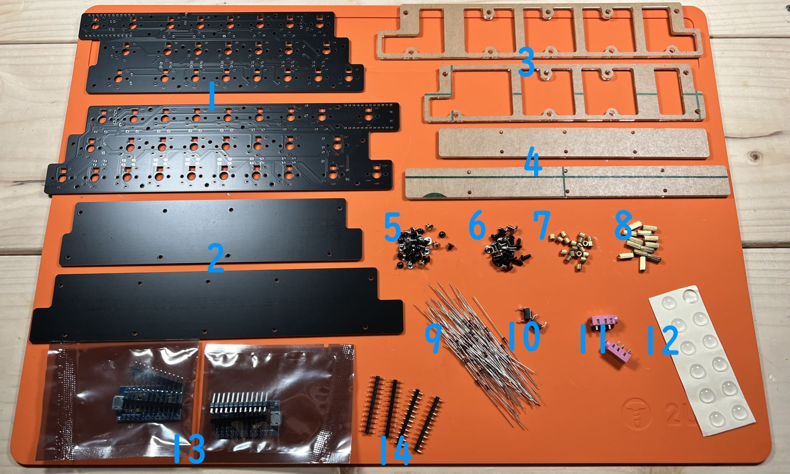
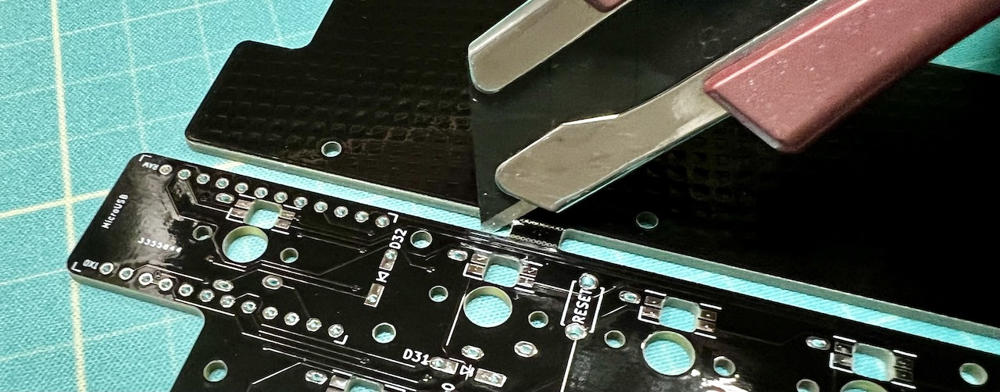
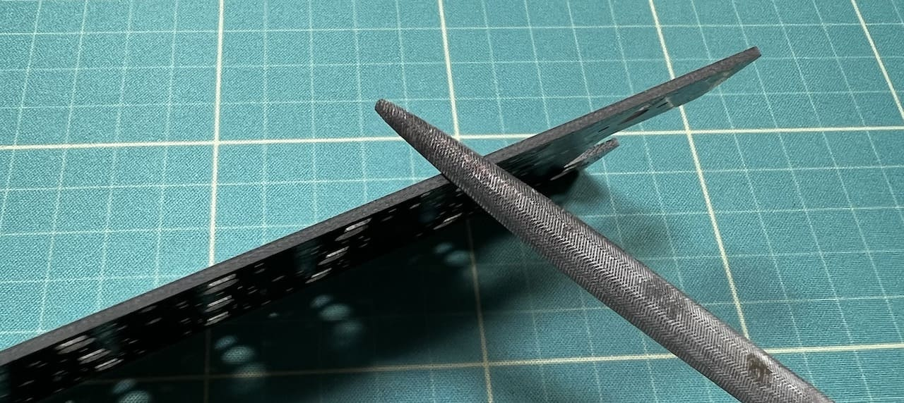
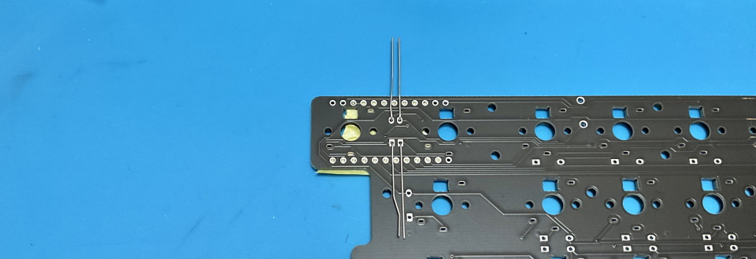
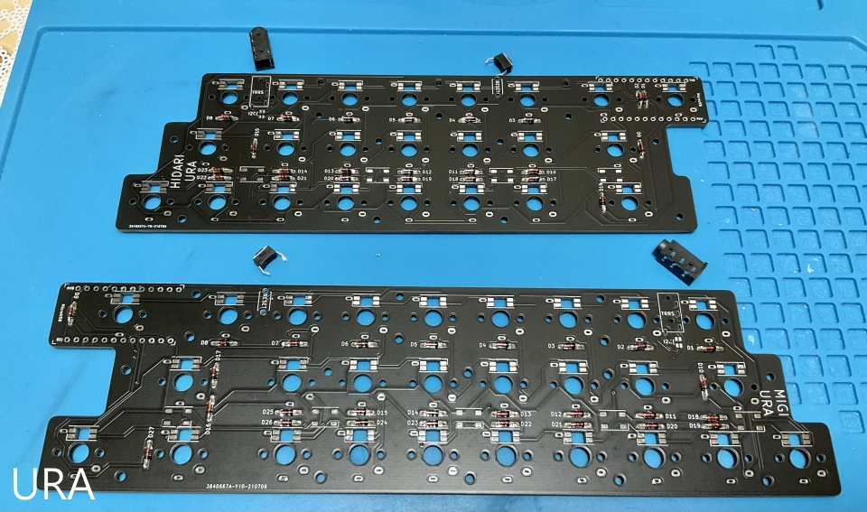
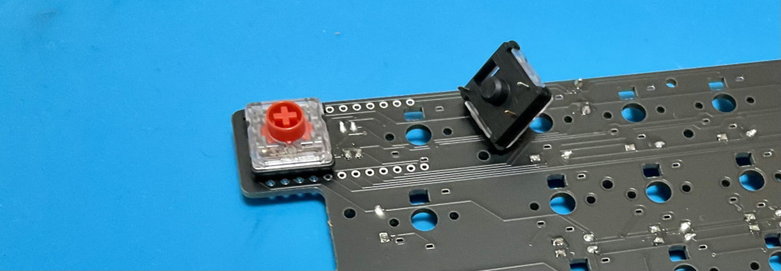

# Pop'n Top キーボード ビルドガイド（[English](https://github.com/Taro-Hayashi/Pop-n-Top/blob/main/README_EN.md)）
- [キット内容](#キット内容)
- [組み立て方（はんだ付け）](#組み立て方はんだ付け)
- [動作テスト](#動作テスト)
- [組み立て方（後半）](#組み立て方後半)
- [カスタマイズ](#キーマップの確認変更方法)
- [その他](#その他)

## キット内容
  
※TRRSジャックの色は違う可能性があります。  
||部品名|数| |
|-|-|-|-|
|1|メインボード（黒・大）|2||
|2|ボトムプレート（黒・中）|2||
|3|ミドルプレート（透明・中）|2||
|4|ボトムプレート（透明・小）|2||
|5|ネジ（短）|36|3mm|
|6|ネジ（長）|24|5mm|
|7|スペーサー（短）|18|3mm|
|8|スペーサー（長）|12|8mm|
|9|ダイオード|50||
|10|リセットスイッチ|2||
|11|TRRSジャック|2||
|12|ゴム足|12||
|13|Pro Micro|2||
|14|コンスルー|4||

## キット以外に必要なもの
|部品名|数||
|-|-|-|
|キースイッチ|50|[Kailh choc V1](https://shop.yushakobo.jp/collections/all-switches/products/pg1350)、もしくは[Kailh Choc V2](https://shop.yushakobo.jp/collections/all-switches/products/kailh-choc-v2)|
|キーキャップ|50|[選び方](howtochosekeycaps.md)|
|TRRSケーブル|1||
|Micro-USB ケーブル|1||

## LED（[取り付け方](led.md)）
|部品名|数|||
|-|-|-|-|
|SK6812MINI-E|50|バックライト|[遊舎工房](https://shop.yushakobo.jp/products/sk6812mini-e-10) / [秋月電子通商](https://akizukidenshi.com/catalog/g/gI-15478/)|
|WS2812B|9|アンダーグロー|[遊舎工房](https://shop.yushakobo.jp/products/a0800ws-01-10) / [秋月電子通商](https://akizukidenshi.com/catalog/g/gI-07915/)|

## 必要な工具
|工具名|
|-|
|はんだごて|
|こて先クリーナー（こて台）|
|鉛入りはんだ|
|精密ドライバー|
|カッター|
|棒ヤスリ|
|ニッパー等ダイオードの足を切れるもの|
|Microsoft Edge、もしくはGoogle Chrome|

## あると便利な工具
|工具名|
|-|
|耐熱シリコンマット|
|温度調節可能なはんだごて|
|斜めに切ったタイプのこて先|
|フラックス|
|フラックスリムーバー、IPA|
|ピンセット
|マスキングテープ|
|テスター|
|はんだ吸い取り線|
|はんだ吸い取り器|

## 準備
PCBはつながった状態で梱包されています。カッターナイフで軽く切れ込みを入れて曲げるように割ります。  
  
棒やすりで跡をきれいにします。  
  

## 組み立て方（はんだ付け）
正しくはんだ付けが終わるとこのようになります。  

はんだ付けのやり方は動画で見るとわかりやすいです。  
パーツは思ったより壊れないので落ち着いて作業すると失敗しにくいです。
 - ホームセンターのDCMさんの解説動画(58秒～) https://www.youtube.com/watch?v=JFQg_ObITYE&t=58s

それではダイオードを取り付けます。  
足を曲げて裏から差し込みます。  
  
ダイオードには向きがあります。三角形の先の棒と黒線を合わせましょう。  

表で更に足を曲げて抜けないようにします。  
ダイオードと並行に曲げるとあとでキースイッチに干渉しにくいです。  
  

はんだ付けをして足を切ります。  
  

TRRSジャックを裏から差し込み表ではんだ付けします。  
終わったらリセットスイッチを裏から差し込み表ではんだ付けします。   
   
フラックスリムーバーを使う場合ここで表面をきれいにしましょう。
  

キースイッチを表から差し込み裏ではんだ付けします。  
  

メインボードの裏にコンスルーを挿します。  
コンスルーの窓が高くて両方とも同じ向きになるように設置します。  
   
挿すだけではんだ付けはしません。  

コンスルーにPro Microを挿します。TX0, RAW, USBの位置をシルク印刷と合わせましょう。  
   
そして、Pro Micro側のコンスルーの足を半田付けします。  
   
これでPro Microを抜き差しできるようになりました。  
両手分作り終えたら次に進んでください。  

## 動作テスト
Pro Microに動作ソフト（ファームウェア）を書き込んで動作確認をしましょう。  
キットとPCをUSBケーブルでつないでください。   

下のwebサイトにアクセスしてください。
- https://remap-keys.app/catalog/HJaX1fzuC9SmEQEK3czS/firmware

テストファームウェアを選んでFLASHします。
  
  

キットのリセットスイッチを押すとArduino Microが現れるので、クリックして接続します。
 

書き込みが完了したらウィンドウを閉じて大丈夫です。
 

USBで接続しないと書き込めないので分割キーボードでは左手用と右手用に同じ手順を繰り返します。  
右手用にも同じファームウェアを書き込んでください。  

書き込めたら一度USBケーブルを外し、TRRSケーブルで左右を繋げます。  
（TRRSケーブルを抜き差しするときはPCとは接続しない方が安全だそうです。）  
左手用とPCをUSBケーブルで接続してタイプすると1-50の数字が打てるはずです。     

お疲れ様でした。問題がなければはんだ付けは終了です。  

## 組み立て方（後半）
USBケーブル、TRRSケーブルを抜いてプレートを組付けます。  
アクリルからは保護フィルムを剥がしてください。割れやすいので気をつけましょう。  

メインボード裏面の赤丸の箇所にスペーサー（短）をネジ（短）で取り付けてミドルプレート（透明・中）を嵌めます。  
  
ボトムプレート（黒・中）をネジ（短）で止めます。  

メインボードの残ったネジ穴にスペーサー（長）をネジ（長）で取り付け、ボトムプレート（透明・小）をネジ（長）で止めます。  
   

キーキャップを取り付けたら先ほどと同様の手順で本番用のファームウェアに更新しましょう。
- https://remap-keys.app/catalog/HJaX1fzuC9SmEQEK3czS/firmware
  

ゴム足を貼ってTRRSケーブルで左右を繋いだら完成です。  
  
  
USBケーブルは左手用に接続してください。  

## キーマップの確認、変更方法
このキットはレイヤー機能を使っています。  

[Keyboard Layout Editor で見る](http://www.keyboard-layout-editor.com/#/gists/a78d9342dd93a60fed1b255a5a018bf9)  

使わないキーを削除したり使用頻度の高いキーを押しやすい位置に変更してみましょう。  

  ChromeかEdgeでRemapにアクセスしてください。  
- Remap https://remap-keys.app/  

  
左を選んで進んでいくとアドレスバーからメッセージが出てキーボードを選択できます。

キーマップをドラッグアンドドロップで変更し右上のflashボタンを押すと反映されます。  
  
RemapにはMac用のレイアウトも用意してありますのでよかったら手間を省くのに使ってください。

## 液晶タブレットに乗せる場合
1番上の行を引っ掛ける事で液タブに乗せる事ができます。  
  
ゴム足を外して両面テープで固定すると安定します。  
跡が残るといけないので画面には保護フィルムを貼ってください。  

## その他

### 色違いアクリルプレート
遊舎工房さんで注文可能です。  
- https://shop.yushakobo.jp/collections/services/products/keyboard_acrylic_plate?variant=43890222498023  
  
デザインデータを公開しているのでご自分で発注をかけることも可能です。  
- [popntop_plates.zip](https://github.com/Taro-Hayashi/Pop-n-Top/releases/download/14.20/popntop_plates.zip)  
  
### ファームウェアのフォルダ  
https://github.com/Taro-Hayashi/qmk_firmware/tree/tarohayashi/keyboards/tarohayashi/popntop  
  
### VIA用のJSONファイル
- [popntop_leftconnected.json](https://github.com/Taro-Hayashi/Pop-n-Top/releases/download/14.15/popntop_leftconnected.json)  
  
### 謝辞
foostan様のフットプリントを流用、改変して使わせていただきました。  
https://github.com/foostan/kbd/  
https://github.com/foostan/kbd/blob/master/LICENSE  

- 遊舎工房: https://shop.yushakobo.jp/products/2796  
- BOOTH: https://tarohayashi.booth.pm/items/3154435  
