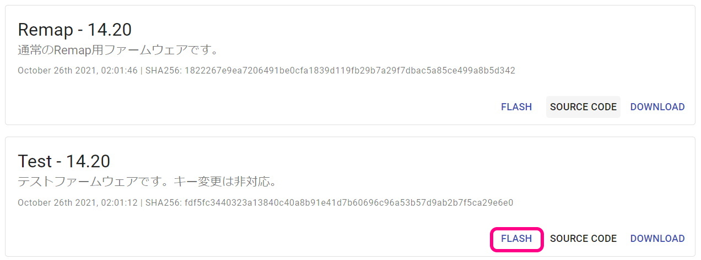
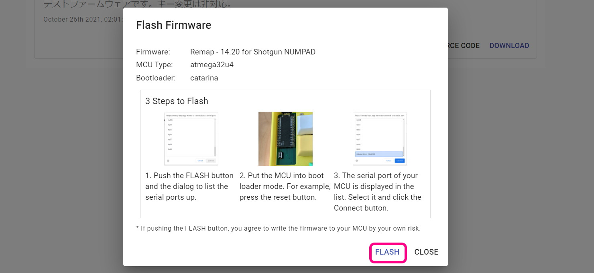
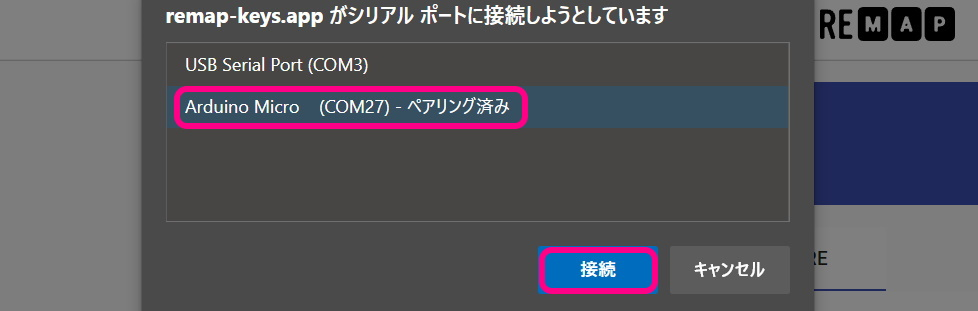

# Pop'n Top キーボード Build Manual ([日本語](https://github.com/Taro-Hayashi/Pop-n-Top/blob/main/README.md))
- [Contents](#Contents)
- [Soldering](#Soldering)
- [Testing](#Testing)
- [Assembling](#Assembling)
- [Customize](#Customize)

## Contents
  
||Name|Quantity| |
|-|-|-|-|
|1|Main Board|2|Shorter is left side.|
|2|Middle Plates|2||
|3|PCB Bottom Plates|2||
|4|Acrylic Bottom Plates|2||
|5|Short screws|36|3 mm|
|6|Long screws|24|5 mm|
|7|Short Spacers|18|3 mm|
|8|Long Spacers|12|8 mm|
|9|Diodes|50||
|10|Tactile Switches|2||
|11|TRRS Jacks|2||
|12|Rubber feet|12||

## Additional required
|Name|Quantities|| 
|-|-|-|
|Pro Micro (With Conthrough)|2|[Yushakobo](https://shop.yushakobo.jp/en/products/promicro-spring-pinheader)|
|Switches|50|Kailh Low Profile Switches V1/V2|
|Keycaps|50|42: 1U, 3: 1.5U, 2: 1.75U, 3: 2U|
|TRRS cable|1|[Yushakobo](https://shop.yushakobo.jp/en/products/trrs_cable)|
|Micro-USB Cable|1|[Yushakobo](https://shop.yushakobo.jp/en/products/usb-cable-micro-b-0-8m)|

## Optional
|Name|Quantities||
|-|-|-|
|SK6812MINI-E|50|[Yushakobo](https://shop.yushakobo.jp/en/products/sk6812mini-e-10)|
|WS2812B|9|[Yushakobo](https://shop.yushakobo.jp/en/products/a0800ws-01-10)|

## Soldering  
This is What it looks like if you done. 

Install the diodes from D1 to D23 for the left side, and D1 to D27 for the right side.      
  
Diodes have a direction.

Bend the legs parallel to the diode to prevent interference with the key switch later.  
  

Solder and cut the legs.  
  

Solder TRRS Jacks and Tactile Switches.   
   
If you want to remove the flux from the surface, now is the time.
  

Solder Switches. 
  

Put conthroughs.
Make the top and bottom and front and back the same.  
    

And put Pro Micro on conthroughs.
   
Solder Pro Micro. 
   

## Testing
Connect one of them to the PC with a USB cable.  
Access Remap's firmware page with Chrome or Edge.
- https://remap-keys.app/catalog/HJaX1fzuC9SmEQEK3czS/firmware

Flash the Test firmware.
  
  

Push the tactile switch.
 
 

Do the same for the other side.

Disconnect all USB cables, and use TRRS Cable to connect the left and right sides, then connect the left side with the USB cable.  
You can type numbers from 1 to 50.  
  
If there are no problems, soldering is finished.  

## Assembling  
Fasten the short spacer to the place circled in red on the back side with a short screw.  
And fit the middle plate.
  

Fasten the PCB bottom plate with short screws.
Attach the long spacer to the remaining screw holes with long screws, and secure the acrylic bottom plate with long screws.  
   

After installing the keycap, follow the same procedure as before to update the firmware for production.
- https://remap-keys.app/catalog/HJaX1fzuC9SmEQEK3czS/firmware
  

Attaching the rubber feet and connecting the left and right sides with the TRRS cable, it is complete.    
  
  

Thank you for your time.  

## Customize

[Keyboard Layout Editor](http://www.keyboard-layout-editor.com/#/gists/a78d9342dd93a60fed1b255a5a018bf9)  
  
Access Remap. 
- Remap https://remap-keys.app/  
  
Select the blue button on the left to proceed.  
  
  
After Drag-and-Drop the keys, press the flash button in the upper right corner.  
  

## Misc
Firmware  
https://github.com/Taro-Hayashi/qmk_firmware/tree/master/keyboards/popntop  

JSON for Remap/VIA  
[popntop_leftconnected.json](https://github.com/Taro-Hayashi/Pop-n-Top/releases/download/14.15/popntop_leftconnected.json)  

plates data  
[popntop_plates.zip](https://github.com/Taro-Hayashi/Pop-n-Top/releases/download/14.15/popntop_plates.zip)  

Used foostan's footprint.
https://github.com/foostan/kbd/  
https://github.com/foostan/kbd/blob/master/LICENSE  

- Yushakobo: https://shop.yushakobo.jp/en/products/2796  
- BOOTH: https://tarohayashi.booth.pm/items/3154435  
