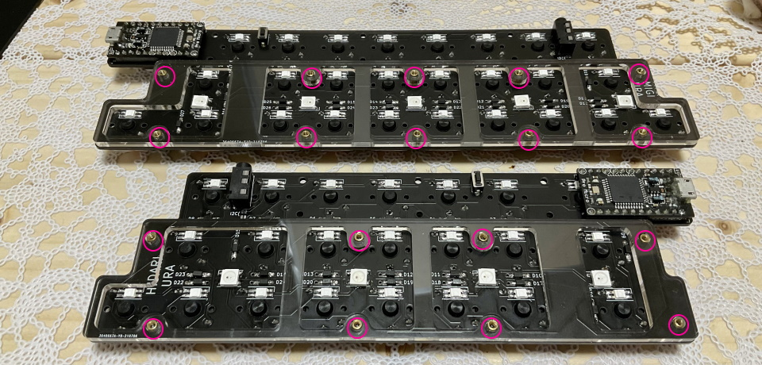

# Pop'n Top キーボード Build Manual ([日本語](https://github.com/Taro-Hayashi/Pop-n-Top/blob/main/README.md))
- [Contents](#Contents)
- [Soldering](#Soldering)
- [Testing](#Testing)
- [assembling](#assembling)
- [Customize](#Customize)

## Contents
  
||Name|Quantity| |
|-|-|-|-|
|1|Main Board|2|Shorter is left side.|
|2|Middle Plates|2||
|3|PCB Bottom Plates|2||
|4|Acrylic Bottom Plates|2||
|5|Short screws|36|3 mm|
|6|Long screws|24|5 mm|
|7|Short Spacers|18|3 mm|
|8|Long Spacers|12|8 mm|
|9|Diodes|50||
|10|Tactile Switches|2||
|11|TRRS Jacks|2||
|12|Rubber feet|12||

## Additional required
|Name|Quantities|| 
|-|-|-|
|Pro Micro (With Conthrough)|2|[Yushakobo](https://shop.yushakobo.jp/en/products/promicro-spring-pinheader)|
|Switches|50|Kailh Low Profile Switches V1/V2|
|Keycaps|50|42: 1U, 3: 1.5U, 2: 1.75U, 3: 2U|
|TRRS cable|1||
|Micro-USB Cable|1||

## Optional
|Name|Quantities||
|-|-|-|
|SK6812MINI-E|50|[Yushakobo](https://shop.yushakobo.jp/en/products/sk6812mini-e-10)|
|WS2812B|9|[Yushakobo](https://shop.yushakobo.jp/en/products/a0800ws-01-10)|

## 組み立て方（はんだ付け）
正しくはんだ付けが終わるとこのようになります。  

それではダイオードを、左手用はD1からD23まで右手用はD1からD27まで取り付けます。  
足を曲げて裏から差し込みます。  
  
ダイオードには向きがあります。三角形の先の棒と黒線を合わせましょう。  

表で更に足を曲げて抜けないようにします。  
ダイオードと並行に曲げるとあとでキースイッチに干渉しにくいです。  
  

はんだ付けをして足を切ります。  
  

TRRSジャックを裏から差し込み表ではんだ付けします。  
終わったらリセットスイッチを裏から差し込み表ではんだ付けします。   
   
フラックスリムーバーを使う場合ここで表面をきれいにしましょう。
  

キースイッチを表から差し込み裏ではんだ付けします。  
  

メインボードの裏にコンスルーを挿します。  
コンスルーの窓が高くて両方とも同じ向きになるように設置します。  
   
挿すだけではんだ付けはしません。  

コンスルーにPro Microを挿します。TX0, RAW, USBの位置をシルク印刷と合わせましょう。  
   
そして、Pro Micro側のコンスルーの足を半田付けします。  
   
これでPro Microを抜き差しできるようになりました。  
両手分作り終えたら次に進んでください。  

## 動作テスト
Pro Microに動作ソフト（ファームウェア）を書き込んで動作確認をしましょう。  
左手用とPCをUSBケーブルでつないでください。   

ファームウェアをダウンロードしてEdgeかChromeでPro Micro Web Updaterにアクセスしてください。  
- テスト用ファームウェア [popntop_test.hex](https://github.com/Taro-Hayashi/Pop-n-Top/releases/download/14.20/popntop_leftconnected_test.hex)  
- Pro Micro Web Updater https://sekigon-gonnoc.github.io/promicro-web-updater/index.html  

ファイルの選択ボタンを押してダウンロードしたファームウェアを指定したら、flashボタンを押しましょう。  
  

ブラウザのアドレスバーからメッセージが出てきたら、キットのリセットスイッチを押します。  
すると選択欄にArduino Microが出てきてクリックできるようになります。  
  

選択して接続を押すと書き込みが終わります。  
  
ファームウェアを更新する時もこの手順で行います。  

USBで接続しないと書き込めないので分割キーボードでは左手用と右手用に同じ手順を繰り返します。  
右手用にも同じファームウェアを書き込んでください。  

書き込めたら一度USBケーブルを外し、TRRSケーブルで左右を繋げます。  
（TRRSケーブルを抜き差しするときはPCとは接続しない方が安全だそうです。）  
左手用とPCをUSBケーブルで接続してタイプすると1-50の数字が打てるはずです。     

お疲れ様でした。問題がなければはんだ付けは終了です。  

## 組み立て方（後半）
USBケーブル、TRRSケーブルを抜いてプレートを組付けます。  
アクリルからは保護フィルムを剥がしてください。割れやすいので気をつけましょう。  

メインボード裏面の赤丸の箇所にスペーサー（短）をネジ（短）で取り付けてミドルプレート（透明・中）を嵌めます。  
  
ボトムプレート（黒・中）をネジ（短）で止めます。  

メインボードの残ったネジ穴にスペーサー（長）をネジ（長）で取り付け、ボトムプレート（透明・小）をネジ（長）で止めます。  
   

キーキャップを取り付けたら本番用のファームウェアに更新しましょう。  
- [popntop_via.hex](https://github.com/Taro-Hayashi/Pop-n-Top/releases/download/14.20/popntop_leftconnected_via.hex)  

ゴム足を貼ってTRRSケーブルで左右を繋いだら完成です。  
  
  
USBケーブルは左手用に接続してください。  

## キーマップの確認、変更方法
このキットはレイヤー機能を使っています。  

[Keyboard Layout Editor で見る](http://www.keyboard-layout-editor.com/#/gists/a78d9342dd93a60fed1b255a5a018bf9)  

使わないキーを削除したり使用頻度の高いキーを押しやすい位置に変更してみましょう。  

  ChromeかEdgeでRemapにアクセスしてください。  
- Remap https://remap-keys.app/  

  
左を選んで進んでいくとアドレスバーからメッセージが出てキーボードを選択できます。

キーマップをドラッグアンドドロップで変更し右上のflashボタンを押すと反映されます。  
  

Firmware  
https://github.com/Taro-Hayashi/qmk_firmware/tree/master/keyboards/popntop  

JSON for Remap/VIA  
[popntop_leftconnected.json](https://github.com/Taro-Hayashi/Pop-n-Top/releases/download/14.15/popntop_leftconnected.json)  

plates data  
[popntop_plates.zip](https://github.com/Taro-Hayashi/Pop-n-Top/releases/download/14.15/popntop_plates.zip)  

Used foostan's footprint.
https://github.com/foostan/kbd/  
https://github.com/foostan/kbd/blob/master/LICENSE  

- Yushakobo: https://shop.yushakobo.jp/products/2796  
- BOOTH: https://tarohayashi.booth.pm/items/3154435  
