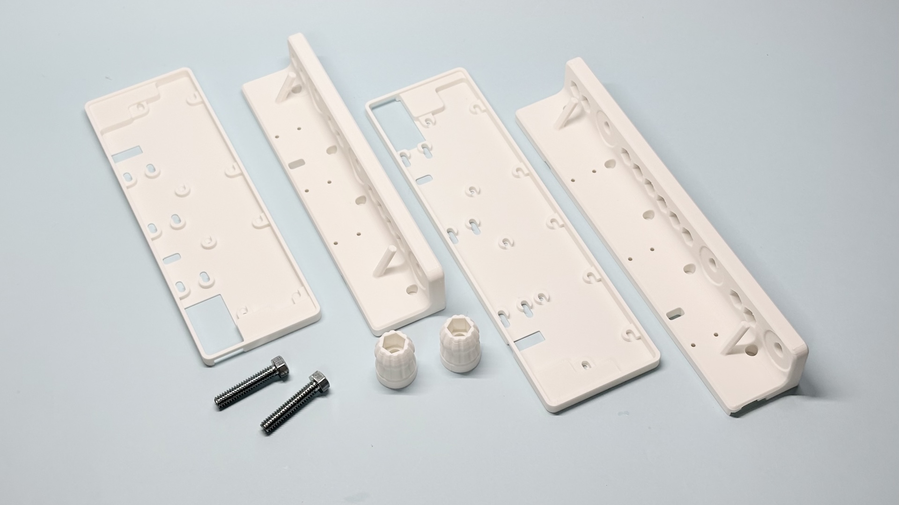
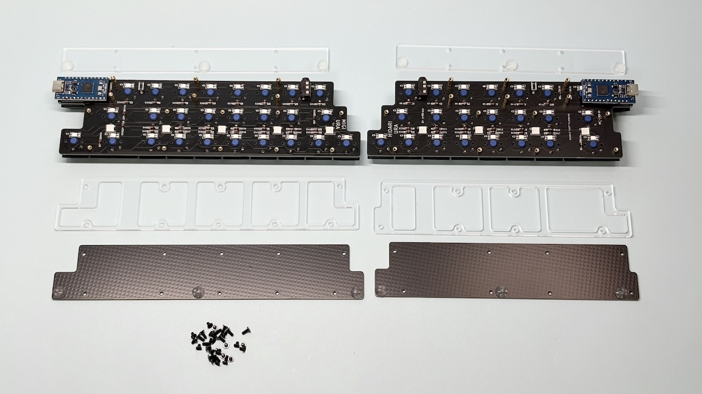
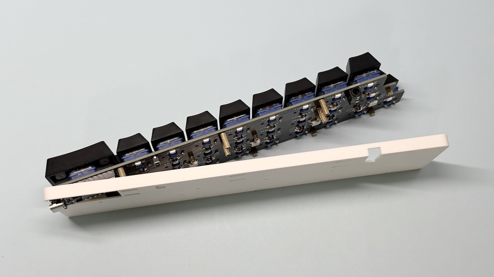
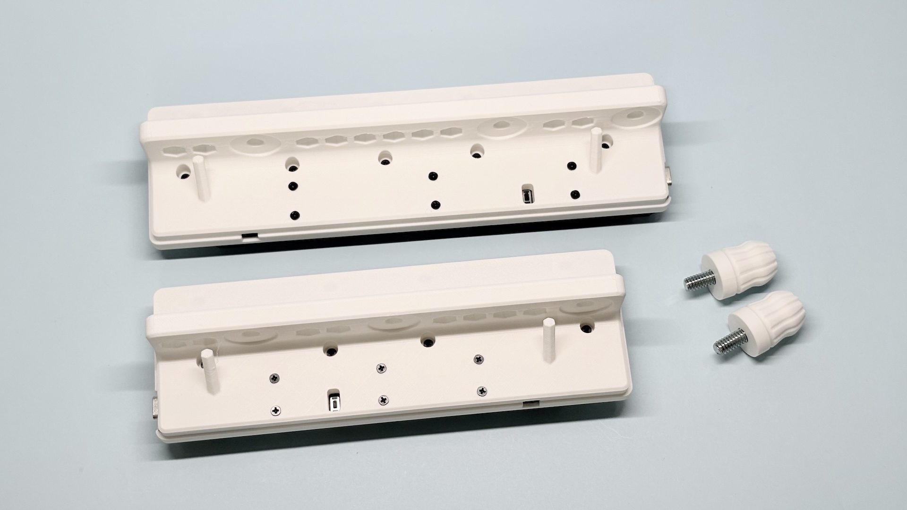
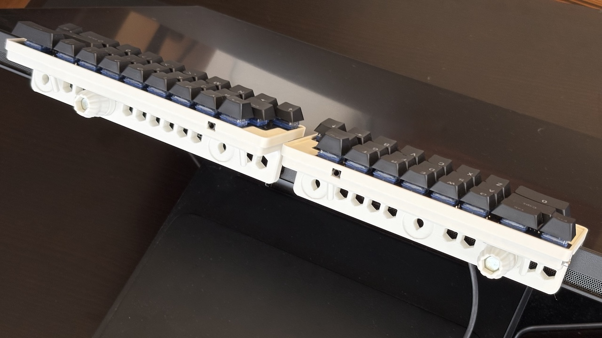
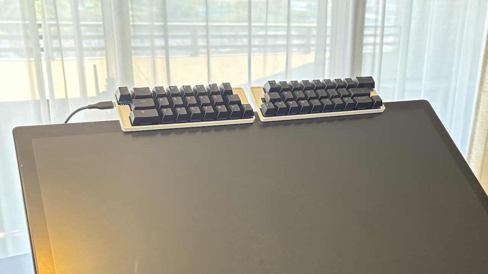
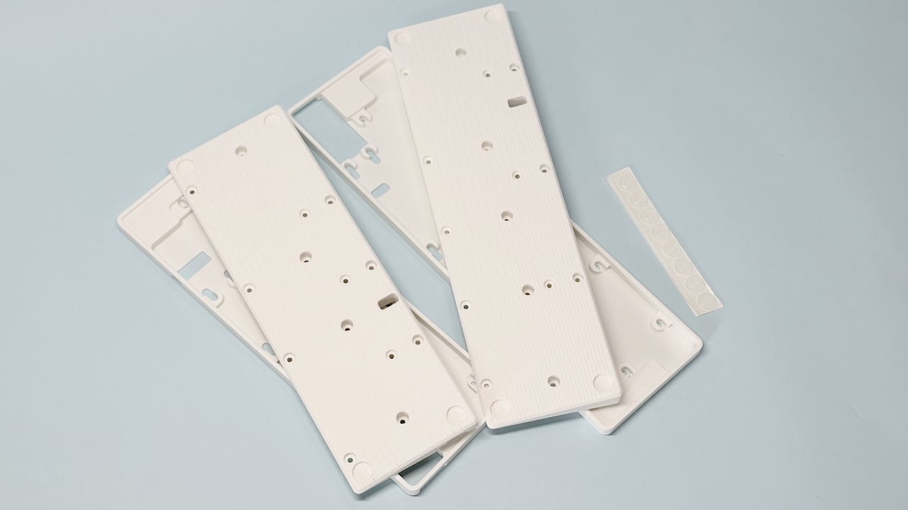
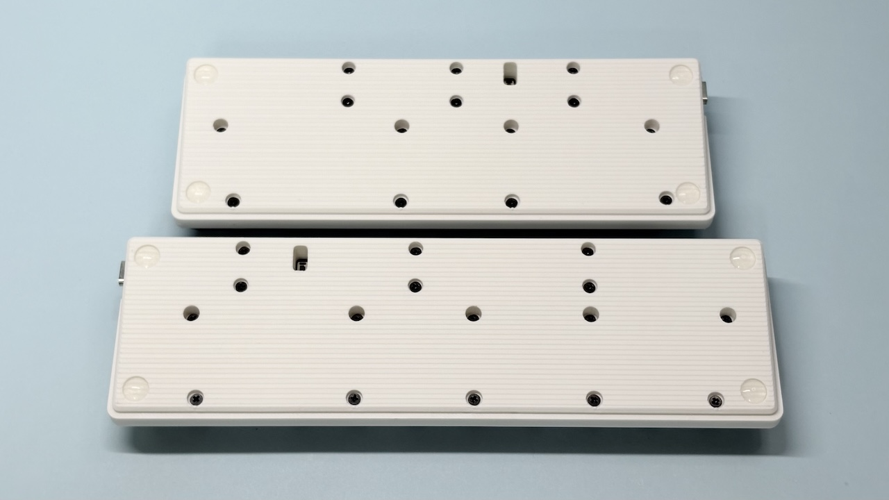
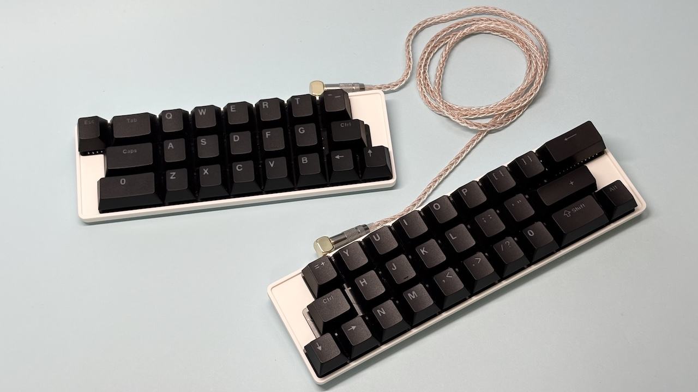

# Pop'n Top Cintiq Pro用インチネジケース、机上用ケースの取り付け方

## Cintiq Pro用インチネジケース

キーボード背面のネジを全て外してアクリルプレート、ボトムプレートを外します。

メインボードをケースに収めます。

もとのネジでケースを取り付けます。

Cintiq Proに固定します。

片手につき3種類取り付け場所があります（22では左右が重なって使えないパターンがあります）。

## 机上用ケース

キーボード背面のネジを全て外してアクリルプレート、ボトムプレートを外します。

メインボードをケースに収めます。

もとのネジでケースを取り付けてゴム足を付けます。

