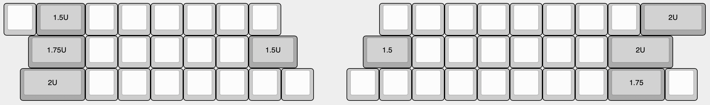

# キーキャップの選び方
スイッチに対応したキーキャップを購入してください。  
choc V1は専用のキーキャップが販売されていて、choc V2はCherry MX互換のキーキャップが使えます。

キーキャップの長さに種類があります。  

|長さ|個数|
|-|-|
|1U|42個|
|1.5U|3個|
|1.75U|2個|
|2U|3個|  

Uというのは正方形を1とした時の横幅です。
choc V1を使う場合1.75Uのキーキャップは1.5U以下を使ってください。

## おすすめキーキャップセット
- NP PBT Crayon KEYCAPS SET（choc V2向け）  
https://shop.yushakobo.jp/collections/keycaps/products/np-pbt-crayon-keycaps-set
- NP PBT BLANK KEYCAP SET（choc V2向け）  
https://talpkeyboard.net/items/6027a2686e84d5793d776135  
https://shop.yushakobo.jp/collections/keycaps/products/np-pbt-blank-keycaps-set-124-keys
- MBK Legend‡ Glow（choc V1向け）  
https://shop.yushakobo.jp/collections/keycaps/products/2609

ブラウザの機能で戻ってください。
