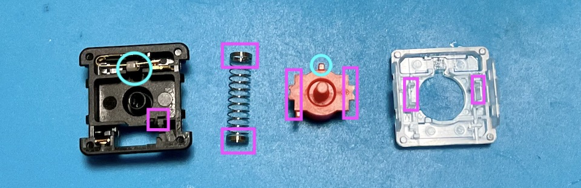

## キースイッチの選び方
Kailh choc v2という高さが低いキースイッチに対応しています。  
軸の色で性能が違います。カチカチ音がする青、音がしない赤、中間の茶色があります。  

choc v1も使えます。  
v2とv1で使えるキーキャップが違うのでお気をつけください。  

潤滑剤を塗る方もいらっしゃると思います。  
私は赤枠の部分に塗りました。  
  
青丸の部分は購入時にすでに何か塗られているようで、別のルブが付くと押下時にひっかかりを感じるようになるのでなるべく触らないようにしました。  
35gのスプリングに交換するために開腹したのでついでに塗りましたがCherryMX互換のスイッチに塗った時ほどの効果は感じませんでした。  
軽いスプリングはやわらかいスイッチが好きな方にはおすすめです。
