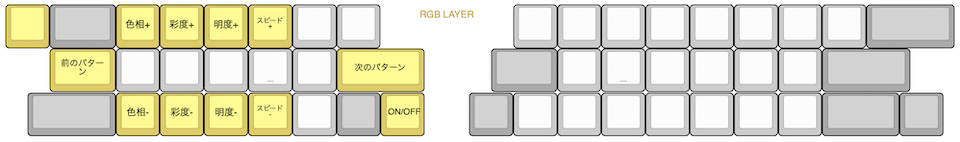

## LEDの取り付け方
※ご注意  
左右分割でLEDの数も多いため常時点灯するような光らせ方をするとTRRSケーブル先のPro Microがハングアップします。  
物足りないかもしれませんがキーを押したときに光るようなパターンを使ってください。  
デフォルトファームウェアではリアクティブ系の発光以外は無効にしてあります。  

|部品名|数|||
|-|-|-|-|
 |SK6812MINI-E|50|バックライト|[遊舎工房様販売ページ](https://shop.yushakobo.jp/products/sk6812mini-e-10)|
 |WS2812B|9|アンダーグロウ。無くてもバックライトだけ光ります。|[遊舎工房様販売ページ](https://shop.yushakobo.jp/products/a0800ws-01-10)|

LEDの切り欠きとシルク印刷のコーナーを合わせてはんだ付けしましょう。  
  
向きがバラバラなので毎回確認してください。  
メインボードにフラックスを塗り、こて先にのせたはんだを流し込むようにするとスムーズに付けられます。

LEDは直列に配線されています。  
  
ひとつ発光しないLEDがある場合その先全てのLEDが光らなくなるので画像と見比べてどこが原因かを調べましょう。  

用意されたファームウェアであればはんだ付けするだけでLEDが使えます。  
ESC長押しでRGB操作用のレイヤーになります。  

[Keyboard Layout Editor で見る](http://www.keyboard-layout-editor.com/##@_backcolor=#ffffff&name=Layout%20-%20Pop'n%20Top%20KEYBOARD&author=T.Hayashi&switchMount=cherry&switchBrand=kailh&switchType=PG151101D05//D43&pcb:true;&@_c=#777777&a:7;&=&_c=#aaaaaa&w:1.5;&=&_c=#cf7e7e;&=!&=/@&=#&=$&=%25&_st=PG151101D05//D43;&=~&_x:3&c=#cccccc;&=&_c=#cf7e7e;&=F1&=F2&=F3&=F4&=F5&=F6&_c=#cccccc;&=&_c=#cf7e7e&w:2;&=delete;&@_x:0.75&c=#aaaaaa&w:1.75;&=&_c=#cf7e7e;&=%5E&=/&&=*&_n:true;&=(&=)&_c=#aaaaaa&w:1.5;&=&_x:2&w:1.5;&=&_c=#cf7e7e;&=F7&_n:true;&=F8&=F9&=F10&=F11&=F12&_c=#d99393&w:2;&=↑;&@_x:0.5&c=#aaaaaa&w:2;&=&_c=#cccccc;&=&=&=&=&=&_c=#cf7e7e;&=&_c=#aaaaaa;&=&_x:1;&=&=&_c=#cccccc;&=&=&=&=&=&_c=#d99393;&=←&_w:1.75;&=↓&_fa@:2;;&=→;&@_y:-0.25&x:8.75&c=#cccccc&t=#c91818&a:5&f:3&w:2.5&d:true;&=↑%0AUPPER%20LAYER;&@_y:-0.25&c=#777777&t=#000000%0A#dbbc1f&f2:2;&=esc%0A長押しRGB&_c=#aaaaaa&t=#000000&a:7&w:1.5;&=tab&_c=#cccccc;&=Q&=W&=E&=R&=T&_a:5&f:3;&=/_%0A%0A%0A%0A%0A%0A-&_x:3&f:3;&=+%0A%0A%0A%0A%0A%0A/=&_a:7;&=Y&=U&=I&=O&=P&_a:5&f:3;&=%7B%0A%0A%0A%0A%0A%0A%5B&_f:3;&=%7D%0A%0A%0A%0A%0A%0A%5D&_c=#aaaaaa&a:7&w:2;&=backspace;&@_x:0.75&w:1.75;&=control&_c=#cccccc;&=A&=S&=D&_n:true;&=F&=G&_c=#aaaaaa&w:1.5;&=space&_x:2&w:1.5;&=space&_c=#cccccc;&=H&_n:true;&=J&=K&=L&_a:5&f:3;&=/:%0A%0A%0A%0A%0A%0A/;&_f:3;&=%22%0A%0A%0A%0A%0A%0A'&_c=#aaaaaa&a:7&w:2;&=enter;&@_x:0.5&w:2;&=shift&_c=#cccccc;&=Z&=X&=C&=V&=B&_c=#aaaaaa&t=#c91818%0A#000000&a:5&fa@:2;;&=長押しUPPER%0A英数&_t=#000000&fa@:2&:1;;&=space%0A長押しWin//cmd&_x:1;&=space%0A長押しWIN//CMD&_t=#000000%0A#152bab&fa@:2&:2;;&=かな%0A長押しLOWER&_c=#cccccc&t=#000000&a:7;&=N&=M&_a:5&f:3;&=%3C%0A%0A%0A%0A%0A%0A,&_f:3;&=%3E%0A%0A%0A%0A%0A%0A.&_f:3;&=?%0A%0A%0A%0A%0A%0A//&_f:3;&=%7C%0A%0A%0A%0A%0A%0A%5C&_c=#aaaaaa&a:7&f:3&w:1.75;&=shift&_f:3;&=alt;&@_x:8.75&c=#cccccc&t=#152bab#1d2c8c%0A#152bab&a:5&f:3&w:2.5&d:true;&=LOWER%E3%80%80LAYER%0A↓;&@_y:-0.5&c=#777777&t=#000000&a:7;&=&_c=#aaaaaa&w:1.5;&=&_c=#8792d6&a:5&f:3;&=!%0A%0A%0A%0A%0A%0A1&_f:3;&=/@%0A%0A%0A%0A%0A%0A2&_f:3;&=#%0A%0A%0A%0A%0A%0A3&_f:3;&=$%0A%0A%0A%0A%0A%0A4&_f:3;&=%25%0A%0A%0A%0A%0A%0A5&_f:3;&=~%0A%0A%0A%0A%0A%0A%60&_x:3&c=#cccccc&a:7;&=&=&=&=&=&=&_c=#8792d6&f:3;&=(&_f:3;&=)&_c=#aaaaaa&w:2;&=;&@_x:0.75&w:1.75;&=&_c=#8792d6&a:5&f:3;&=%5E%0A%0A%0A%0A%0A%0A6&_f:3;&=/&%0A%0A%0A%0A%0A%0A7&_f:3;&=*%0A%0A%0A%0A%0A%0A8&_f:3&n:true;&=(%0A%0A%0A%0A%0A%0A9&_f:3;&=)%0A%0A%0A%0A%0A%0A0&_c=#aaaaaa&a:7&w:1.5;&=&_x:2&w:1.5;&=&_c=#8792d6&f:3;&=←&_f:3&n:true;&=↓&_f:3;&=↑&_f:3;&=→&_c=#cccccc;&=&=&_c=#aaaaaa&w:2;&=;&@_x:0.5&w:2;&=&_c=#cccccc;&=&=&=&=&=&_c=#aaaaaa;&=&=&_x:1;&=&_c=#8792d6;&=&_c=#cccccc;&=&=&=&=&=&=&_c=#aaaaaa&f:3&w:1.75;&=shift&=;&@_y:0.75&c=#e0cb58;&=&_c=#aaaaaa&w:1.5;&=&_c=#cccccc;&=&=&=&=&=&=&_x:0.25&t=#a18806&a:5&f:3&w:2.5&d:true;&=RGB%20LAYER&_x:0.25&t=#000000&a:7;&=&=&_c=#e0cb58&f:3;&=色相+&_f:3;&=彩度+&_f:3;&=明度+&_fa@:1;;&=スピード+&_c=#cccccc;&=&=&_c=#e0cb58&f:3&w:2;&=発光のオンオフ;&@_x:0.75&c=#aaaaaa&w:1.75;&=&_c=#cccccc;&=&=&=&_n:true;&=&=&_c=#aaaaaa&w:1.5;&=&_x:2&c=#e0cb58&fa@:2;&w:1.5;&=前のパターン&_c=#cccccc;&=&_n:true;&=&=&=&=&=&_c=#e0cb58&w:2;&=次のパターン;&@_x:0.5&c=#aaaaaa&w:2;&=&_c=#cccccc;&=&=&=&=&=&_c=#aaaaaa;&=&=&_x:1;&=&_c=#cccccc;&=&=&_c=#e0cb58&f:3;&=色相-&_f:3;&=彩度-&_f:3;&=明度-&_fa@:1;;&=スピード%20-&_c=#cccccc;&=&_c=#aaaaaa&w:1.75;&=&=)  
