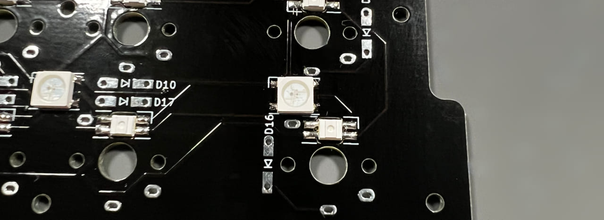

## LEDの取り付け方

LEDの切り欠きとシルク印刷のコーナーを合わせてはんだ付けしましょう。  
  
  
向きがバラバラなので毎回確認してください。

  

左上のキーを長押しでRGB操作用のレイヤーになります。  
  
[Keyboard Layout Editor で見る](http://www.keyboard-layout-editor.com/#/gists/a78d9342dd93a60fed1b255a5a018bf9)  

※分割キーボードでLEDの個数が多いためPro Microにかかる負荷が高いです。右手側の反応がなくなった場合、明度をさげてみてください。

ブラウザの機能で戻ってください。
