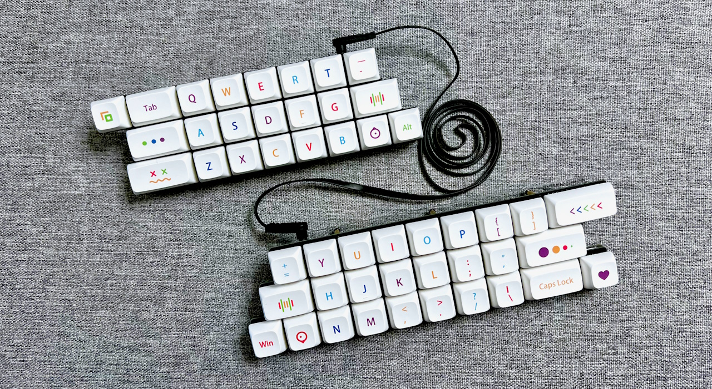
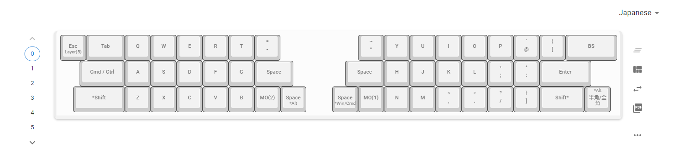
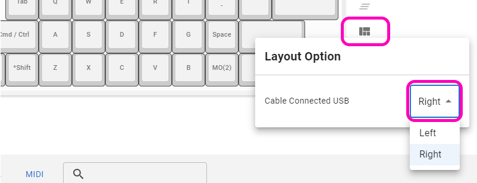
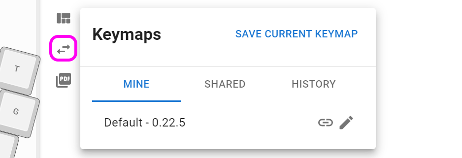
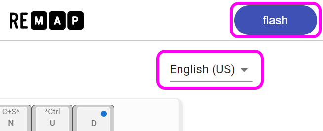
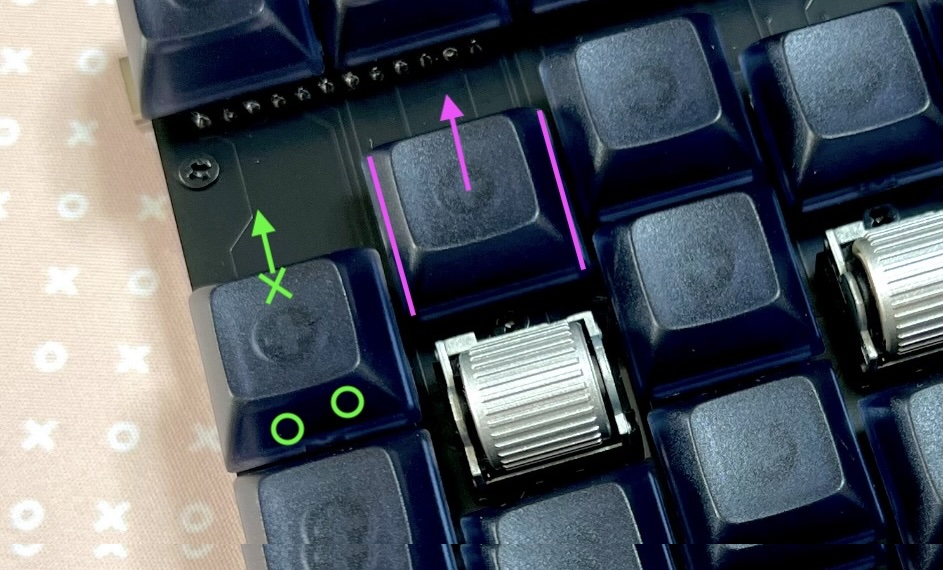

# Pop'n Top キーボード 取り扱い説明書

  
## 内容品
- Pop'n Topキーボード 1個
- TRRSケーブル 1本

 
  
## ご用意いただくもの
- Type-C USBケーブル
- Windows/Mac/Linux（iPad、Androidでも使用できますが設定ができません）
## ファームウェアの書き込み
まずは動作ソフト（ファームウェア）をPop'n Topに書き込みます。  
Google ChromeかMicrosoft Edgeでこちらにアクセスし、Flashをクリックします。

- https://remap-keys.app/catalog/HJaX1fzuC9SmEQEK3czS/firmware

> [!NOTE]
> USBを接続する側でファームウェアを選んで、両手のキーボードに同じファームウェアを書き込んでください。
  
   
   
  
キット裏面のリセットスイッチを2回素早く押すと新しく項目が出てきます。
  
  
   

選択して接続を押すと書き込みが始まります。

 
CLOSEを押してファームウェアの書き込みは完了です。

## キーのカスタマイズ
Google Chrome（Microsoft Edge）でこちらにアクセスしてください。
- Remap https://remap-keys.app

  
左を選んで進んでいくとダイアログが出てキーボードを選択できます。  
  
選択して接続してください。
  

### USBの接続側を選ぶ
まずはレイアウトオプションでUSBの接続側を選んでください。  
  

### キーマップの保存と復元
⇔アイコンで作ったキーマップを保存することができます。  
  
作ったキーマップを共有することもできるので是非お試しください。

### キーを設定する
下のキー一覧からドラッグアンドドロップし、変更が終わったら右上のflashボタンを押すと反映されます。  
  
また、USキーボードとJISキーボードはFlashの下のプルダウンから変更できます。OSの設定に合わせてください。

### 修飾キーとの組み合わせを設定する
キーボードのキーをクリックすると設定画面になります。
  
修飾キーと同時押ししたいキーを検索し、同時押ししたい修飾キーにチェックを入れます。
  

Hold-Tapもここから設定できます。

### 特殊なキーを設定する
FUNCTIONSタブのVIA USER KEYにあらかじめ用意されたショートカットキーがあります。
  

## その他
### キーキャップの引き抜き方
スイッチはキーキャップ側から見て下部の2点ではんだ付けされています。上部を持ち上げるように手前に引っ張ると金具が曲がり隙間が出来てしまうことがあります。
キーキャップ引き抜き用の工具を使い側面を掴み垂直に引き抜く事を意識すると抜きやすいです。
  

### 液晶タブレットに乗せる
1番上の行を引っ掛ける事で液タブに乗せる事ができます。  
  
ゴム足を外して両面テープで固定すると安定します。  
跡が残るといけないので画面には保護フィルムを貼ってください。  

### ファームウェアのフォルダ  
https://github.com/Taro-Hayashi/qmk_firmware/tree/tarohayashi/keyboards/tarohayashi/popntop

### 販売サイト
- 遊舎工房: https://shop.yushakobo.jp/collections/keyboard/products/2796   
- BOOTH: https://tarohayashi.booth.pm/items/3154435

