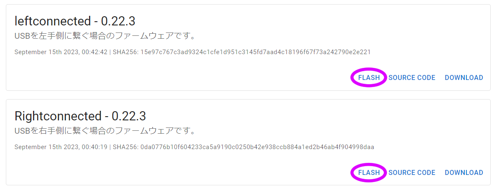
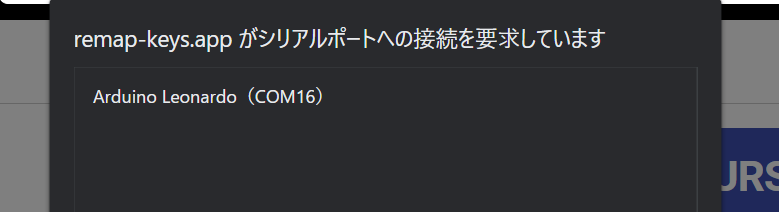
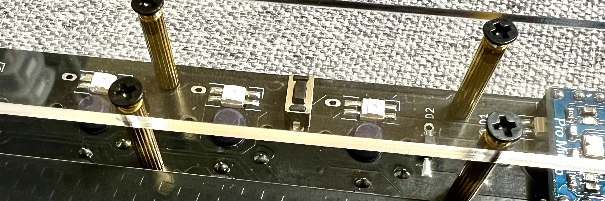
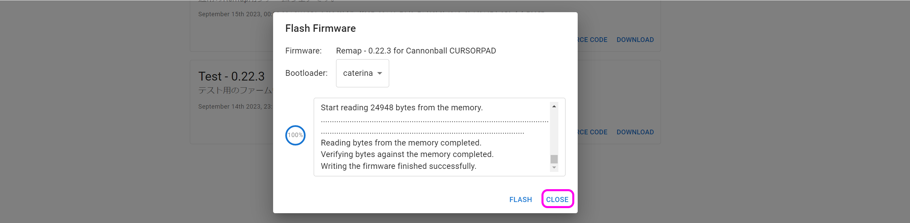

# Pop'n Top キーボード 取り扱い説明書

 
  
## ファームウェアの書き込み
到着したらまずは動作ソフト（ファームウェア）をCannonballに書き込みます。  
Google ChromeかMicrosoft Edgeでこちらにアクセスし、Remap用ファームウェアのFlashをクリックします。

- https://remap-keys.app/catalog/HJaX1fzuC9SmEQEK3czS/firmware

> [!NOTE]
> USBを接続する側に合わせてファームウェアを選んで、両方に同じファームウェアを１回ずつ計２回書き込んでください。
  
   
   
  
キット裏面のリセットスイッチを2回素早く押すと新しく項目が出てきます。
  
  
   

選択して接続を押すと書き込みが始まります。

 
CLOSEを押してファームウェアの書き込みは完了です。

### USBの接続側を選ぶ
レイアウトオプションでUSBの接続側を選んでください。  
  

## キーのカスタマイズ
Google Chrome（Microsoft Edge）でこちらにアクセスしてください。
- Remap https://remap-keys.app

  
左を選んで進んでいくとダイアログが出てキーボードを選択できます。  
  
選択して接続してください。
  

### キーマップの保存と復元
⇔アイコンで作ったキーマップを保存することができます。  
  
作ったキーマップを共有することもできるので是非お試しください。

### キーを設定する
下のキー一覧からドラッグアンドドロップし、変更が終わったら右上のflashボタンを押すと反映されます。  
  
また、USキーボードとJISキーボードはFlashの下のプルダウンから変更できます。OSの設定に合わせてください。

### 修飾キーとの組み合わせを設定する
キーボードのキーをクリックすると設定画面になります。
  
修飾キーと同時押ししたいキーを検索し、同時押ししたい修飾キーにチェックを入れます。
  

Hold-Tapもここから設定できます。

### ロータリーエンコーダーを設定する
丸いキーの左下をクリックすると時計回り、反時計回り、押し込みを切り替えることができるので、それぞれにキーを割り当てます。
  

### 特殊なキーを設定する
FUNCTIONSタブのVIA USER KEYにあらかじめ用意されたショートカットキーがあります。
  

## その他
### ファームウェアのフォルダ  
https://github.com/Taro-Hayashi/qmk_firmware/tree/tarohayashi/keyboards/tarohayashi/popntop

### 販売サイト
- 遊舎工房: https://shop.yushakobo.jp/collections/keyboard/products/2797   
- BOOTH: https://tarohayashi.booth.pm/items/3172502

