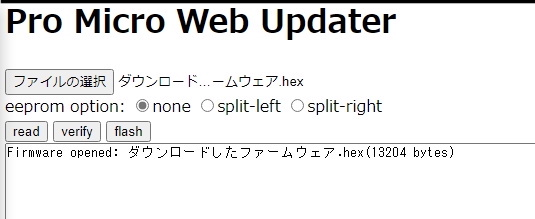
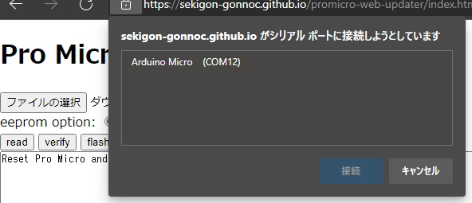
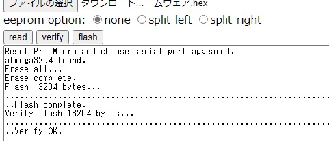

## ファームウェアの書き込みにPro Micro Web Updaterを使う場合
- テスト用ファームウェア [popntop_test.hex](https://github.com/Taro-Hayashi/Pop-n-Top/releases/download/untagged-6f31185aea07d10a6589/popntop_test.hex)
- Pro Micro Web Updater https://sekigon-gonnoc.github.io/promicro-web-updater/index.html

ファイルの選択ボタンを押してダウンロードしたファームウェアを指定したら、flashボタンを押しましょう。  
  

ブラウザのアドレスバーからメッセージが出てきたら、キットのリセットスイッチを押します。      
すると選択欄にArduino Microが出てきてクリックできるようになります。  
  

選択して接続を押すと書き込みが終わります。  
  

反対側も同じファームウェアを書き込みます。  

ブラウザの戻るで戻ってください
