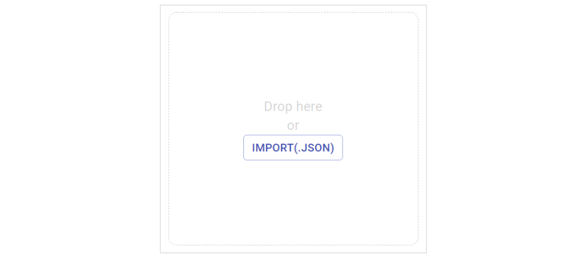

## キーマップの変更にRemapを使う場合
JSONファイルをダウンロードしてwebサイトにアクセスしてください。
- [popntop.json](https://github.com/Taro-Hayashi/Pop-n-Top/releases/download/untagged-6f31185aea07d10a6589/popntop.json)
- Remap https://remap-keys.app

左の青いボタンを押して、次の画面では+KEYBOARDをクリックします。  
   

アドレスバーからメッセージが出てくるのでキーボードの名前をクリックします。  
ダウンロードしたJSONファイルを指定するかドラッグアンドドロップしましょう。  

  
下に並んでいるキーをキーボードにドラッグアンドドロップすると配置が変わります。  
右上のflashボタンを押すとキーボードに反映されます。  

ブラウザの戻るで戻ってください
